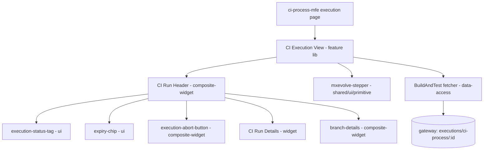

# Design — VAL-26634: [UI/UX][CI] Build & Test Run Page Header & Run Stepper

## Figma & Visual References
> Figma file: **MxEvolve** (`8Z7emdDFkZapK3nmVP2HsA`). Node ids are appended as `?node-id=...&m=dev`.

| Ref | Link | What it shows | Used by |
|-----|------|---------------|---------|
| 9615-68110 | [Run Header & Stepper](https://www.figma.com/design/8Z7emdDFkZapK3nmVP2HsA/MxEvolve?node-id=9615-68110&m=dev) | CI Build & Test run page header + run stepper (the feature design) | S3, S4, S5 |
| Jira img | `wiki-context/jira_config_params.png` | Config Parameters row: Repository, Configuration Branch (`test-objects-0002`), Configuration Parent Branch (`main`) | S3 |
| Jira img | `wiki-context/jira_skip_step.png` | Skipped step: `Prepare Setup - Skipped` (greyed + checkmark) → `Build & Test` (active) → `Merge` (pending) | S2, S5 |
| Wiki img | `wiki-context/wiki_img1.png` | Wiki technical-notes screenshot | reference |

> Only node `9615-68110` was shared. Per-state child frames were **not** pulled this session (no Figma
> token). Implementers should open that node and, if needed, pull child frames via the `query-figma`
> skill before building. The 3 screenshots in `wiki-context/` are the authoritative captured visuals.

## Architecture Overview
Replicate the Upgrade Process layering for CI. The new feature view composes a composite-widget
run header + the shared stepper; data flows from a new CI data-access lib via `rxResource`. The
view is hosted inside the existing `ci-process-mfe` for now (legacy header removed).

## Affected Modules
| Layer | Module | Path | Role |
|-------|--------|------|------|
| Feature | business-process/feature | `web/libs/domains/business-process/feature/src/lib/build-and-test/` | New CI execution view + run stepper wiring |
| Composite-widget | business-process/composite-widget | `web/libs/domains/business-process/composite-widget/src/lib/build-and-test/execution-run-header/` | New CI run header (tabs, status, expiry, abort) |
| Widget | business-process/widget | `web/libs/domains/business-process/widget/src/lib/build-and-test/activity-run-details/` | CI Run Details (General/Config/Infra) |
| Composite-widget (reuse) | business-process/composite-widget | `.../branch-details/` | Branch Details tab (reused as-is) |
| UI (reuse) | business-process/ui | `.../execution-status-tag/`, `.../expiry-chip/` | Status + expiry atoms (reused) |
| Composite-widget (reuse) | business-process/composite-widget | `.../execution-abort-button/` | Abort (reused, already supports CI family) |
| Data-access | business-process/data-access | `web/libs/domains/business-process/data-access/src/lib/build-and-test/` | New CI fetcher + user-input service + DTOs |
| Shared primitive | shared/ui/primitive | `web/libs/shared/ui/primitive/src/lib/stepper/` | Extend with `skipped` status |
| Shared primitive (reuse) | shared/ui/primitive | `.../illustrations/` | Create-branch loading illustration |
| Consumer | ci-process-mfe | `web/apps/ci-process-mfe/src/app/ci-process/ci-process-execution/ci-process-execution-details/` | Swap legacy header/stepper for new |
| Routing | shell | `web/apps/shell/src/app/business-process/business-process-routing.module.ts` | Unchanged (MFE still routed) |

## Key Design Decisions
| # | Decision | Rationale | Alternatives considered |
|---|----------|-----------|-------------------------|
| 1 | Mirror Upgrade Process layering exactly (feature → composite-widget → widget → ui → data-access) | Consistency; proven pattern; reuse | Put everything in the MFE (rejected — defeats migration) |
| 2 | New data-access folder named `build-and-test` | User choice | `ci-process` (rejected) |
| 3 | Per-stage Start/End dates carried in `StepDefinition.tooltip` (no stepper API change for dates) | `tooltip` field already exists; `merge-request-stepper` already uses this exact pattern | Add date inputs to stepper (rejected — unnecessary) |
| 4 | Add a new `"skipped"` `StepStatus` to the shared stepper (greyed checkmark, non-clickable, `"- Skipped"` suffix) | Skipped ≠ inactive; screenshot shows a checkmark for a reached-but-skipped step | Reuse `inactive` (rejected — wrong icon/semantics) |
| 5 | No Reference Environments tab for CI | Wiki: "No Reference Environment like in the upgrade process" | Keep tab (rejected) |
| 6 | No NgRx; use signals + `rxResource` | Matches Upgrade Process; legacy NgRx not migrated | Port NgRx store (rejected) |
| 7 | Reuse `ExecutionFamily.USER_STORY_BUILD_AND_TEST` | Already defined; abort/checkbox already branch on it | New enum value (rejected — exists) |
| 8 | Copy legacy DTOs/services into new data-access (not import from `@mxflow/features/business-process`) | New domain libs must be self-contained; legacy lib is deleted later | Depend on legacy lib (rejected) |

## Data & Contract Changes
- **No backend/API contract changes.** Reused endpoints:
  - `GET {gw}/projects/{projectId}/business-process/executions/ci-process/{ciProcessId}` (fetcher)
  - `POST .../ci-process/{id}/user-input/*` (repush-prepare-build-environment, send-changes-for-review, reopen-merge-request, fix-integration-issues, commits-cherry-picked, repush-backport-merge-job, proceed-with-predefined-inputs)
  - `GET .../business-process/executions/ci-process` (list — only if needed; not required for header/stepper)
- **New TS models** (copied/adapted from legacy): `BuildAndTestProcessExecution`, `BuildAndTestProcessExecutionInput`, `BuildAndTestProcessBuildEnvironmentInput`, stage types, status enums. Field renames applied at the **display layer**, not the DTO:
  - `buildAndTestInfraGroup` → label **"Test Environment Infra Group"**
  - `buildEnvironmentInfraGroup` → label **"Build Environment Infra Group"** (unchanged)

## Existing Patterns To Reuse
- Header structure & tabs: `ExecutionRunHeaderComponent` (`.../upgrade-process/execution-run-header/`).
- Run details rendering with `RepositoryNameComponent` (scm/widget), `InfraGroupNameComponent` (infra/widget), `ShowMoreLessTextComponent` (`@mxflow/ui/utils`).
- Fetcher pattern: `ExecutionFetcherService` + `rxResource` in the view.
- Stepper tooltip dates: `merge-request-stepper.component.ts` `computeStepTooltip`.
- Loading state: `mxevolve-illustration name="designing_architecture_in_metaverse"` for create-branch.
- Tests: each lib has `*.spec.ts`; follow the `unit-testing` + `web-unit-test-runner` skills.

## Risks & Mitigations
- **Skipped-status change touches a shared primitive** used by other steppers → keep `skipped` purely additive (new enum member + icon/branch); add stepper unit tests covering all 5 statuses; verify existing stepper consumers still compile.
- **Legacy DTO drift** (copy vs import) → copy the exact fields the header/stepper need; trace each field end-to-end (data-flow-tracing skill) so nothing renders empty.
- **Wiring into MFE without breaking stages** → keep stage components untouched; only replace the header/stepper host; guard with the existing execution data shape.
- **Start/End dates absent in Upgrade but required here** → source from `stage.startDate` / `stage.endDate` on each `BuildAndTestProcessStage`.
