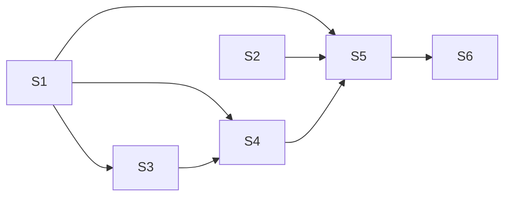

# Story Map — VAL-26634: [UI/UX][CI] Build & Test Run Page Header & Run Stepper

> Suggestions only. This agent does NOT create or modify Jira tickets.

## Detailed Story Files
The 6 slices below are grouped into **4 implementation-ready story files** under `stories/`:

| Story file | Slices | Title |
|------------|--------|-------|
| [story-1-data-access-and-stepper.md](stories/story-1-data-access-and-stepper.md) | S1 + S2 | CI Data-Access + Stepper `skipped` status |
| [story-2-run-details-widget.md](stories/story-2-run-details-widget.md) | S3 | CI Run Details widget |
| [story-3-run-header.md](stories/story-3-run-header.md) | S4 | CI Run Header composite-widget |
| [story-4-execution-view-and-mfe-wiring.md](stories/story-4-execution-view-and-mfe-wiring.md) | S5 + S6 | CI Execution View + Stepper, MFE wiring & legacy removal |

## Suggested Story Slices
| # | Slice | Summary | Layer(s) | Suggested owner | Reviewers |
|---|-------|---------|----------|-----------------|-----------|
| S1 | CI data-access | New `build-and-test` data-access: copy/adapt DTOs (`BuildAndTestProcessExecution`, input, stages, enums), fetcher (`GET executions/ci-process/{id}`), user-input service + Pact-aligned tests | data-access | FE | FE lead |
| S2 | Stepper `skipped` status | Add `"skipped"` `StepStatus` to shared `mxevolve-stepper` (greyed checkmark, non-clickable, `"- Skipped"` suffix) + tests | shared/ui/primitive | FE | UI-primitive owner |
| S3 | CI Run Details widget | New `activity-run-details` for CI: General (Template Name, Activity Type, Description), Config Params (Repository, Configuration Branch, Configuration Parent Branch), Build Scenario Definition, Infra Params with renames + tests | widget | FE | FE lead |
| S4 | CI Run Header composite | New `execution-run-header` for CI: compose status tag, expiry chip, abort button, Run Details tab, Branch Details tab (reused); NO Reference Env tab + tests | composite-widget | FE | FE lead |
| S5 | CI Execution View + Stepper | New feature view: `rxResource` fetch, compute `StepDefinition[]` incl. start/end-date tooltips + skip handling, create-branch illustration loading state, wire header + stepper + tests | feature | FE | FE lead |
| S6 | Wire into MFE & remove legacy | Replace legacy header/stepper usage in `ci-process-execution-details` with the new view; remove old header usage; keep stage bodies untouched + tests | ci-process-mfe | FE | FE lead |

## Dependency Order

## Parallelization Opportunities
- **S1** (data-access) and **S2** (stepper status) are independent — start both in parallel.
- After S1: **S3** (run details) can proceed while S2 finishes.
- **S4** needs S1 + S3; **S5** needs S2 + S4; **S6** is last (integration).

## Per-Slice Test Obligations & Definition of Done

### S1 — CI data-access
- **Tests:** service unit tests (fetcher URL + mapping), DTO mapping; align with existing Pact contract paths (no new contracts unless an endpoint shape changes).
- **DoD:** new `build-and-test` data-access compiles, exports models + services, all tests green; no dependency on `@mxflow/features/business-process`.

### S2 — Stepper `skipped` status
- **Tests:** stepper spec covers all 5 statuses (active/inactive/completed/failed/skipped): correct icon, `skipped` non-clickable, `"- Skipped"` suffix rendering; existing consumers still compile.
- **DoD:** `StepStatus` includes `"skipped"`; horizontal + vertical templates handle it; no regression in existing steppers.

### S3 — CI Run Details widget
- **Tests:** renders all General/Config/Infra fields; verifies renames (`buildAndTestInfraGroup` → "Test Environment Infra Group"); reuses `RepositoryNameComponent`/`InfraGroupNameComponent`.
- **DoD:** component renders from a `BuildAndTestProcessExecution`; optional Description hidden when empty; tests green.

### S4 — CI Run Header composite
- **Tests:** tab options computed (Run Details + Branch Details only, no Reference Env); status tag, expiry chip (shown unless finished), abort wired with CI family.
- **DoD:** header matches Upgrade Process structure minus Reference Env; tests green.

### S5 — CI Execution View + Stepper
- **Tests:** `steps()` computes statuses + start/end-date tooltips; skipped build-env step → `skipped`; create-branch loading illustration shown on first creation; URL/step sync if applicable.
- **DoD:** full view renders header + stepper from fetched execution; loading + failure states handled; tests green.

### S6 — Wire into MFE & remove legacy
- **Tests:** MFE execution page renders the new view; legacy header component no longer referenced; smoke test of route.
- **DoD:** old header/stepper usage removed from `ci-process-mfe`; new view live; stages untouched; tests green; no dead imports of removed legacy header.
