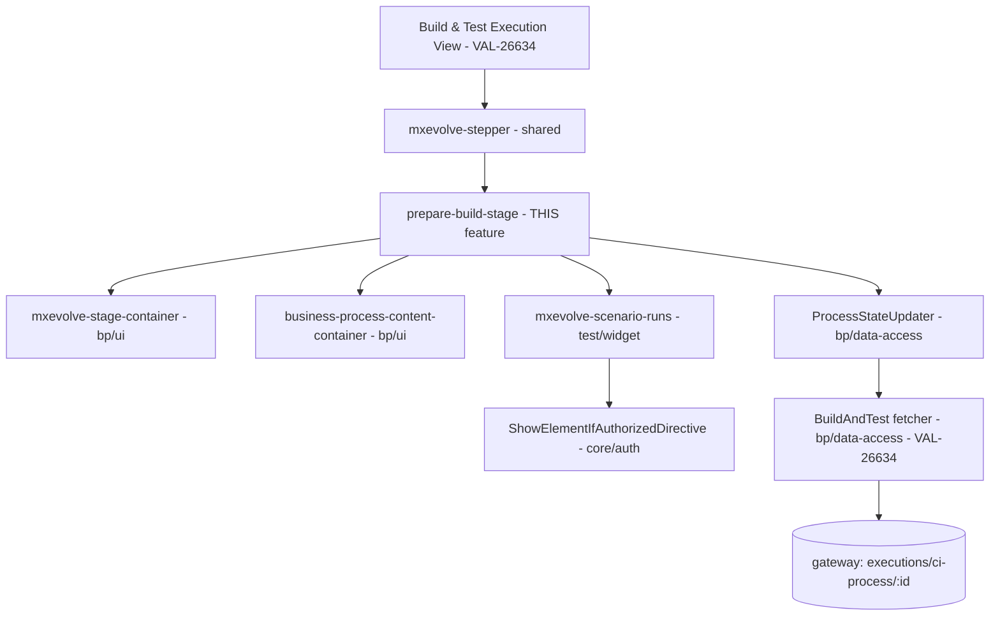

# Design — VAL-26640: [UI/UX][CI] Prepare Setup Step

## Architecture Overview
A thin stage-body component that mirrors `convert-binary-stage`, wrapping `mxevolve-scenario-runs`
with `subContextId="PREPARE_BUILD_ENVIRONMENT"`. Slotted into the Build & Test stepper from VAL-26634.



## Affected Modules
| Layer | Module | Path | Role |
|-------|--------|------|------|
| Feature (new) | business-process/feature | `web/libs/domains/business-process/feature/src/lib/build-and-test-process/prepare-build-stage/` | New stage body component + spec |
| Widget (reuse) | test/widget | `web/libs/domains/test/widget/src/lib/scenario-runs/` | TPK panel — reused with `subContextId="PREPARE_BUILD_ENVIRONMENT"` |
| UI (reuse) | business-process/ui | `.../stage-container/`, `.../business-process-content-container/` | Layout containers |
| Data-access (reuse, VAL-26634) | business-process/data-access | `.../build-and-test/` | Fetcher + `BuildAndTestProcessExecution` model (incl. `prepareBuildStage`) |
| Consumer (legacy, remove later) | ci-process-mfe | `.../prepare-build/` | Replaced by the new stage |

## Key Design Decisions
| # | Decision | Rationale |
|---|----------|-----------|
| 1 | Mirror `convert-binary-stage` exactly | Jira mandates reusing the convert-binary component |
| 2 | `subContextId="PREPARE_BUILD_ENVIRONMENT"` | Confirmed in backend integration tests + dev events |
| 3 | `detailsExpandedByDefault=false` (collapsed) | Wiki Q6 + Note 4 |
| 4 | `showEnvironmentLink=false` + no env badge override | Wiki Q3 + Note 3; same as Convert Binary |
| 5 | Drop `repush-`/`stop-prepare-build-environment` | Wiki Note 6: replaced by widget Rerun/Abort |
| 6 | No stage-level error banner | Convert Binary has none; shell + widget cover errors |
| 7 | No inline Skipped UI | VAL-26634 stepper owns skipped step rendering |
| 8 | No NgRx; signals + state-updater on `(scenarioChanged)` | Mirrors Convert Binary |

## Data & Contract Changes
- **No new endpoints or contracts.** GET `executions/ci-process/:id` owned by VAL-26634.
- **Dropped:** `POST .../user-input/repush-prepare-build-environment` and
  `POST .../user-input/stop-prepare-build-environment` (not migrated).
- `prepareBuildStage` fields (`status`, `startDate`, `endDate`, `requester`,
  `latestScenarioExecutionId`) confirmed in backend read-model; fully covered by VAL-26634's model.

## Template to replicate — `mxevolve-scenario-runs` config from Convert Binary
```html
<mxevolve-stage-container>
  <mxevolve-business-process-content-container header="Prepare Setup">
    <mxevolve-scenario-runs
      class="col-span-12"
      [projectId]="projectId()"
      [contextId]="processId()"
      subContextId="PREPARE_BUILD_ENVIRONMENT"
      [showEnvironmentLink]="false"
      [showHistory]="true"
      [showHistorySummary]="true"
      [showTopBarActions]="false"
      [detailsExpandedByDefault]="false"
      (scenarioChanged)="reloadExecution()"
    >
      <ng-template #topBar>Latest Scenario Run</ng-template>
    </mxevolve-scenario-runs>
  </mxevolve-business-process-content-container>
</mxevolve-stage-container>
```

## Figma References
| Node | Description | URL |
|------|-------------|-----|
| `5628-131855` | Full Page | [Open](https://www.figma.com/design/8Z7emdDFkZapK3nmVP2HsA/MxEvolve?node-id=5628-131855&t=rZjkJqWIj8Gm24GO-0) |
| `5628-132285` | TPK Section detail | [Open](https://www.figma.com/design/8Z7emdDFkZapK3nmVP2HsA/MxEvolve?node-id=5628-132285&t=rZjkJqWIj8Gm24GO-0) |
| `9615-68110` | Dev mode stage detail | [Open](https://www.figma.com/design/8Z7emdDFkZapK3nmVP2HsA/MxEvolve?node-id=9615-68110&m=dev) |
