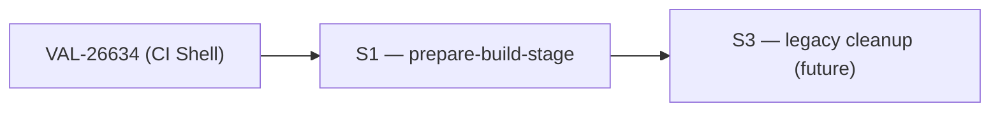

# Story Map — VAL-26640: [UI/UX][CI] Prepare Setup Step

> Suggestions only. This agent does NOT create or modify Jira tickets.

## Suggested Story Slices
| # | Slice | Summary | Layer(s) | Owner |
|---|-------|---------|----------|-------|
| S1 | `prepare-build-stage` | New stage-body component; slots into VAL-26634 stepper | FE | ATLANTIS |
| S3 (future) | Legacy cleanup | Remove `prepare-build/` from `ci-process-mfe` after migration goes live | FE | ATLANTIS |

> **S2 was dropped.** Data-model coverage check (Q1) confirmed `prepareBuildStage` fields are
> already fully supplied by VAL-26634's model. No top-up needed.

## Dependency Order

## Parallelization Opportunities
- **S1 can start immediately once VAL-26634's data-access is merged.** The component compiles against
  the `BuildAndTestProcessExecution` model + `ProcessStateUpdater` — both owned by VAL-26634.
- S3 is independent cleanup; can be done any time after S1 ships and is confirmed stable.

## Per-Slice Test Obligations & Definition of Done

### S1 — `prepare-build-stage`
- **Story file:** `stories/story-S1-prepare-setup-stage.md`
- **Tests:**
  - Shallow unit test (`TestBed` + `MockComponent(ScenarioRunsComponent)`).
  - Assert all `@Input()` values on `ScenarioRunsComponent`: `projectId`, `contextId`, `subContextId`,
    `showEnvironmentLink`, `showHistory`, `showHistorySummary`, `showTopBarActions`,
    `detailsExpandedByDefault`.
  - Assert `(scenarioChanged)` triggers `BuildAndTestProcessStateUpdaterService.reloadProcessDetails(processId, projectId)`.
  - Mirror coverage from `convert-binary-stage.component.spec.ts`.
- **DoD:**
  - Component exists in `web/libs/domains/business-process/feature/src/lib/build-and-test-process/prepare-build-stage/`.
  - Exported from the feature barrel.
  - Registered in the stepper config inside the build-and-test execution view (VAL-26634).
  - All unit tests pass.
  - SonarQube quality gate passes.
  - Legacy `ci-process-mfe` path can be deleted or feature-flagged.

### S3 — Legacy cleanup
- **Tests:** None beyond build passing.
- **DoD:** `web/apps/ci-process-mfe/src/app/ci-process/ci-process-execution/ci-process-execution-stages/prepare-build/` deleted.
