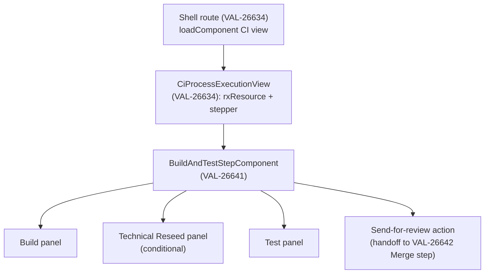
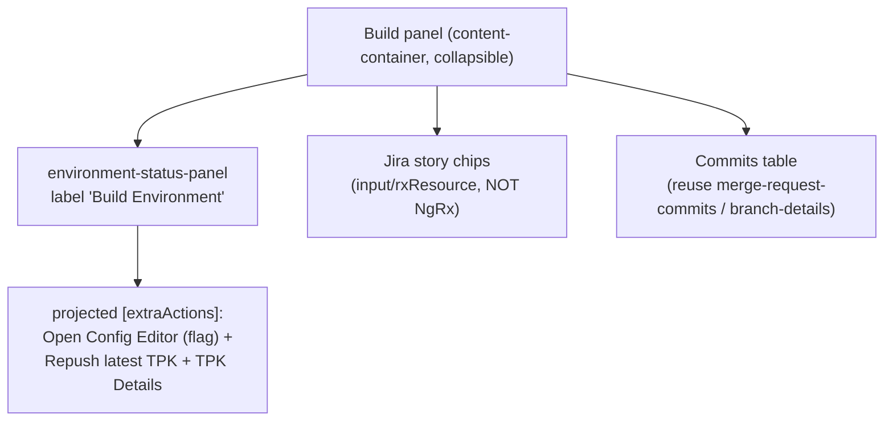
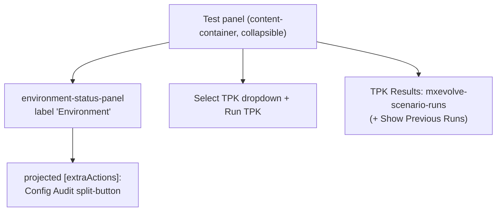

# Design — VAL-26641: CI "Build & Test" step migration

## Architecture Overview
The migrated step is a stage-body component rendered inside the **VAL-26634** run view's stepper, in
the `"build-and-test"` step. It mirrors the migrated **upgrade-process** (`domains/business-process/feature/src/lib/upgrade-process/`):
a view fetches the execution with `rxResource`, drives a `<mxevolve-stepper>`, and each step body is a
standalone component fed by `input()` signals. State changes trigger a **page reload** via a
state-updater service (no NgRx). Errors surface through `ToastMessageService`.

### Build panel (composition)

### Test panel (composition)

## Affected Modules
| Layer | Module / Path | Role in this feature |
|-------|---------------|----------------------|
| Frontend (new lib) | `web/libs/domains/business-process/feature/src/lib/build-and-test-process/` | **New** stage-body components: `build-and-test-step/`, `build-section/`, `technical-reseed-section/`, `test-section/`, `send-for-review/`. |
| Frontend (shared, **edit**) | `web/libs/domains/environment/widget/.../environment-status-panel/` | **Edit (backward-compatible):** add optional `[extraActions]` content-projection slot rendered after Details. |
| Frontend (new widget) | `web/libs/domains/environment/widget/.../config-audit-button/` | **New** `mxevolve-config-audit-button` (port of `features/environment/.../environment-config-audit/button`), color-coded split-button. |
| Frontend (new widget) | `web/libs/domains/environment/widget/.../open-config-editor-button/` | **New** `mxevolve-open-config-editor-button` (port of `features/environment/.../environment-workspace-configuration-editor-button`) to signals. |
| Frontend (new data-access, **OQ2**) | `web/libs/domains/environment/data-access/.../systematic-config-audit/` | **New** `SystematicConfigAuditService` + models + **unit tests + pact contract test** (new endpoint per Khaled). |
| Frontend (new widget) | `web/libs/domains/environment/widget/.../technical-reseed/` (or test/widget) | **New** domains port of `mxevolve-technical-reseed-operation` (drop NgRx → `rxResource`; replace legacy `artifact-manager` `FinalProductService` with the domains artifact widget/service). |
| Frontend (reuse) | `domains/test/widget/.../scenario-runs/`, `domains/scm/widget/.../merge-request-commits/`, `business-process/composite-widget/.../branch-details/`, `shared/ui/primitive/.../commit-id-display/`, `.../illustrations/`, `.../stepper/` | Reused as-is. |
| Frontend (consume, VAL-26634) | CI data-access (`BuildAndTestProcessExecution`, `GET …/executions/ci-process/:id`), state-updater, `"skipped"` status, run header/stepper. | Consumed; may need **additive** model fields (see cross-feature edits). |

## Key Design Decisions
| # | Decision | Rationale | Alternatives considered |
|---|----------|-----------|-------------------------|
| D1 | Mirror **upgrade-process** structure (view = rxResource + stepper; bodies = input-driven standalone components; page-reload state-updater; `ToastMessageService`). | Consistency with the already-migrated reference Khaled asked us to follow; no NgRx. | Re-port legacy NgRx (rejected — against new standard). |
| D2 | Extend shared `environment-status-panel` with an **optional `[extraActions]` projection slot** (renders nothing when unused). | Lets Build inject Open Config Editor + Repush/TPK-Details and Test inject Config Audit **without** breaking upgrade/prepare consumers. | Build a CI-only env bar from individual button widgets (rejected — duplicates layout, drifts from shared bar). |
| D3 | **Config Audit data-access lives in `domains/environment/data-access`** with a dedicated service + models + **pact contract test** (OQ2). Button widget in `domains/environment/widget` consumes it. | Khaled's explicit instruction; keeps data-access out of the widget; enables contract testing of the (newly web-consumed) endpoint. | Reuse `features/environment` service directly (rejected — wrong layer, no domains contract test). |
| D4 | **Technical Reseed status click → info icon + tooltip, NO dialog** (OQ1). | Khaled's decision; preserves legacy lightweight behaviour. | Details dialog (rejected). |
| D5 | **Open Config Editor + Repush-latest-TPK + TPK-Details = Build env bar only; Config Audit = Test env bar only.** | Matches Figma (`5651-143368` Build vs `5657-145421` Test); these are part of the **Build** environment, not Test. | Putting all in one shared bar (rejected — wrong per Figma). |
| D6 | Story chips sourced via `input()`/`rxResource`, **never** NgRx (wiki note 5); avoid redundant refetch. | New-architecture rule; wiki guidance. | NgRx selector (rejected). |
| D7 | Commits table = the **same** `merge-request-commits`/`branch-details` table used in the Branch Details tab (wiki note 6). | Reuse, single source of truth. | New table (rejected). |
| D8 | The Merge **trigger** (Create MR popup + backport) lives in 26641; the **Merge step body** lives in 26642. The popup posts to the existing gateway endpoint and reloads. | Clear feature boundary; build→merge handoff. | Move whole merge into 26641 (rejected — 26642 owns merge). |

## Data & Contract Changes
- **New web data-access endpoint (Config Audit, OQ2/OQ4):** `SystematicConfigAuditService.retrieveSystematicConfigAudit(projectId, environmentId)` →
  `GET {gateway}/projects/{projectId}/environments/{environmentId}/systematic-config-audit` (verify exact path against backend before writing the pact). Response model (port from
  `features/environment/.../models/systematic-config-audit.models.ts`): `SystematicConfigAuditOperationsResponse`
  (`requestStatus` PENDING/STARTED/ENDED/INVALID, `requestResultStatus` SUCCESS/FAILURE/TIMEOUT/ABORTED,
  `configurationLintingResult` {`resultStatus` PASS/WARNING/FAIL, `artifacts[]`, `mode` FULL/DELTA, …}).
  **Add: unit test + `*.spec.pact.ts` contract test** under the data-access lib's contract tests.
- **Technical Reseed:** reuse existing gateway routes (no change):
  `GET /projects/{projectId}/technical-reseed-execution-groups/{egId}`,
  `POST /projects/{projectId}/technical-reseed-execution-groups/{egId}/launch-reseed`
  (`LaunchTechnicalReseedOperationRequest`). Existing pact: `web/pacts/web-mxenv-management.json`.
- **Merge / send-for-review / backport:** reuse existing CI gateway routes (no change):
  `POST …/executions/ci-process/{ciProcessId}/user-input/send-changes-for-review`,
  `…/reopen-merge-request`, `…/repush-backport-merge-job`.
- **CI execution model:** owned by VAL-26634. If Build/Test need a field not yet on
  `BuildAndTestProcessExecution` / `buildAndTestStage`, add it **additively** in 26634's data-access lib
  (see cross-feature edits).

## Cross-Feature Edits (Khaled: "is there anything from other features that needs to be edited?")
| # | What | Where | Why | Risk |
|---|------|-------|-----|------|
| X1 | Add optional `[extraActions]` projection slot | `domains/environment/widget` `environment-status-panel` (a **VAL-26634/shared** asset, also used by upgrade & 26640) | Inject CI-only buttons into Build/Test env bars | Low (additive, no-op when empty) — **regression-test upgrade & prepare-setup screens** |
| X2 | Possibly add additive fields to `BuildAndTestProcessExecution` / `buildAndTestStage` | **VAL-26634** CI data-access/model lib | If Build/Test need data not yet exposed (e.g. story ids, audit env id) | Low — additive; coordinate with 26634 owner |
| X3 | Ensure `"skipped"` StepStatus + stepper support it | **VAL-26634** stepper/primitive | Build & Test step may be skipped | Owned by 26634; 26641 only consumes |
| X4 | New `domains/environment/data-access` config-audit service is a **new shared asset** | `domains/environment/data-access` | Could be reused by other env screens later | Low |
| X5 | MFE removal touches shell/config/pact files shared by all CI features | see story-map S6 | Only after all 4 bodies exist | Med — do last, run full CI |

## Existing Patterns To Reuse
- View/stepper/URL-sync, `rxResource` fetch, `effect()` URL `step` sync, state-updater page reload:
  copy from `upgrade-process-execution-view.component.ts` + `convert-binary-stage.component.ts`.
- Error handling: `ToastMessageService.showError(...)` (as in `build-environment-details.component.ts`
  and validation/upgrade components).
- Containers: `mxevolve-business-process-content-container` (collapsible, header) for each panel;
  `mxevolve-stage-container` for layout.
- Status tags/chips: `execution-status-tag`, `expiry-chip`, `commit-id-display`.
- Tests: `@testing-library/angular` `render()` + `ng-mocks` `MockComponent` + plain-object service mocks
  with `jest.fn()`; `componentProviders` to mock the state-updater (`{ reloadProcessDetails: jest.fn() }`).

## Risks & Mitigations
- **R1 Losing a legacy behaviour** → Each story includes a "legacy parity checklist" diffed against the
  exact legacy file; reviewer signs off parity. (See test-strategy.)
- **R2 Shared `environment-status-panel` regression** → projection slot is optional; add specs proving
  existing consumers render unchanged when no `[extraActions]`.
- **R3 Technical Reseed NgRx → rxResource port** is the riskiest piece (also drops legacy
  `artifact-manager` `FinalProductService`) → isolate in its own story (S3) with full unit + pact coverage.
- **R4 Config Audit endpoint path unverified (OQ4)** → confirm against backend before writing the pact.
- **R5 Parallel work on the same new feature lib** → assign scaffold ownership (OQ5) and keep stage
  bodies in separate folders to avoid merge conflicts.
