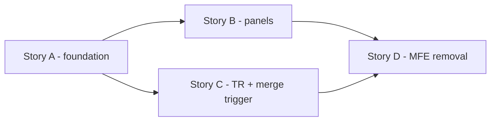
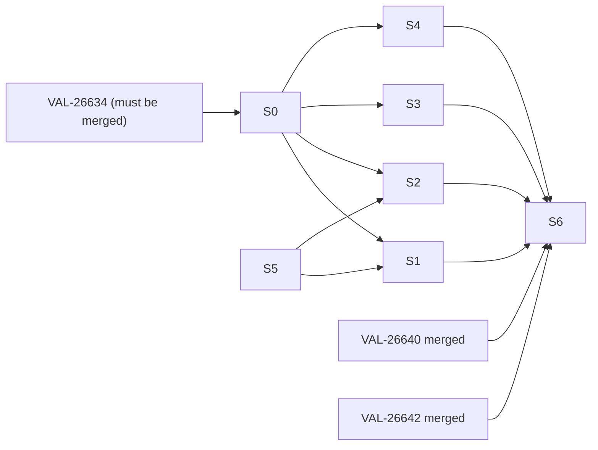

# Story Map — VAL-26641: CI "Build & Test" step migration

> Suggestions only — this does NOT create or edit Jira tickets. Each slice is written to be picked up
> independently by Story Architect / an implementation agent, with Figma refs, legacy parity checklist,
> reuse pointers, and automated tests to run. The MFE-removal tail (S6) is feature-wide cleanup.
>
> **Figma:** every slice lists its frames as (a) a **committed local PNG** under
> `.github/devo/.feature/VAL-26641/figma/<frame>.png` — open it with `view_image`, no auth needed — and
> (b) a **URL** (file key `8Z7emdDFkZapK3nmVP2HsA`, fetch via the `query-figma` skill). See
> `figma-reference.md` for the full index. Each slice also embeds a **textual visual spec** so you can match
> the design even if you cannot render the image. **You MUST open the PNGs and match them.**

## Suggested Story Slices
| # | Slice | Delivers | Layer | Suggested owner | Reviewers |
|---|-------|----------|-------|-----------------|-----------|
| S0 | Feature scaffold + step shell | New `build-and-test-process/` lib, `build-and-test-step` body wired into VAL-26634 stepper, error/loading states (illustration), cherry-pick alert | FE | Build&Test team | FE lead + 26634 owner |
| S1 | Build panel | "Build Environment" `environment-status-panel` + Open Config Editor (flag) + Repush-latest-TPK + TPK-Details + story chips (no NgRx) + commits table | FE | Build&Test team | FE lead |
| S2 | Test panel | "Environment" panel + **Config Audit** (incl. new `domains/environment/data-access` endpoint + pact) + Select/Run TPK + TPK Results (`scenario-runs`) + Show Previous Runs | FE | Build&Test team | FE lead + contracts |
| S3 | Technical Reseed section | Domains port of `technical-reseed` (NgRx→rxResource), conditional panel, rows (status/createdOn/commit/dumpIds see-more), info-icon tooltip (no dialog), Launch dialog | FE | Build&Test team | FE lead |
| S4 | Send-for-review / Merge trigger | Create MR popup (name, destination, reviewers, Backport Yes/No → on-demand run-def multi-select), on-demand backport banner, page-reload on success | FE | Build&Test team | FE lead + 26642 owner |
| S5 | `environment-status-panel` extension | Optional `[extraActions]` projection slot + regression specs proving upgrade/prepare unaffected | FE (shared) | whoever lands first of S1/S2 | FE lead + 26634/26640 owners |
| S6 | **MFE removal tail** | Delete `ci-process-mfe`, switch shell route to domains, remove all ~8 references, fix pacts | FE (cross-cutting) | Build&Test team | FE lead + shell owner |

> S5 is a dependency of S1 & S2 — land it first (small). S0 is a dependency of S1–S4.

## Grouped Stories (execution units)
The 7 slices below are grouped into **4 implementable stories**. Each story is fully self-contained and
AI-implementable. Detailed story files are in `stories/`.

| Story | Slices | Summary | Must-first? | Doc |
|-------|--------|---------|-------------|-----|
| **Story A** | S0 + S5 | Scaffold new lib + env-panel `[extraActions]` slot | **YES — blocks B and C** | [stories/story-A-foundation.md](stories/story-A-foundation.md) |
| **Story B** | S1 + S2 | Build panel + Test panel + Config Audit (new data-access + pact) | After A | [stories/story-B-build-and-test-panels.md](stories/story-B-build-and-test-panels.md) |
| **Story C** | S3 + S4 | Technical Reseed (NgRx→rxResource port) + Merge trigger popup | After A; parallel with B | [stories/story-C-technical-reseed-and-merge-trigger.md](stories/story-C-technical-reseed-and-merge-trigger.md) |
| **Story D** | S6 | MFE removal tail (delete ci-process-mfe, switch shell route) | **Last — after B, C, and sibling features 26640/26642** | [stories/story-D-mfe-removal.md](stories/story-D-mfe-removal.md) |

## Dependency Order

## Parallelization Opportunities
- After **S0** + **S5**, slices **S1, S2, S3, S4** are independent (separate folders) → can be built in parallel.
- **S6** runs only after S1–S4 **and** sibling features VAL-26640 & VAL-26642 are merged (shell route can
  switch only when all CI stage bodies exist in domains).

---

## Per-Slice Detail

### S0 — Feature scaffold + step shell
- **Figma:** `figma/5651-143368.png` (full page, Build expanded), `figma/5642-134873.png` (overview),
  `figma/9629-54097.png` (run header). URLs: node-id=5651-143368 / 5642-134873 / 9629-54097 on file
  `8Z7emdDFkZapK3nmVP2HsA`.
- **Visual spec (from Figma):** run header "Run - 000001" + amber **Pending Input** tag + red power/abort
  button (`9629-54097`); horizontal stepper **Prepare Setup → Build & test → Merge**; the "Build & test"
  step body stacks collapsible panels **Build → (Technical Reseed if present) → Test → Merge action**.
  Loading = create-branch illustration; error = red error alert; cherry-pick = inline alert (legacy text).
- **Reuse:** `upgrade-process/` structure; `business-process-content-container`, `stage-container`,
  `mxevolve-illustration` (create-branch), `execution-status-tag`. Consume VAL-26634 data-access
  (`BuildAndTestProcessExecution`, state-updater, `"skipped"`).
- **Build:** `build-and-test-step.component` (input: execution/stage signals from the view). Renders:
  error alert (if `errorMessage`) → loading illustration (if `!readyForBuildAndTest`) →
  `mxevolve-build-and-test-cherry-pick` (cherryPickRunning/cherryPickFailed/temporaryBranchName) →
  placeholders for Build/TR/Test/Merge panels.
- **Legacy parity checklist** (`build-and-test-stage.component.{ts,html}`): error-alert; info-alert→illustration;
  cherry-pick alert text "same as existing"; section ORDER (cherry-pick → branch/build → TR → test → merge).
- **Tests (run):** unit spec via `render()` covering each conditional branch (error / loading / cherry-pick
  running / cherry-pick failed / ready). Mock state-updater. **No NgRx.**
- **DoD:** step appears in the stepper; all top-level states render; nx lint + affected unit tests green.

### S1 — Build panel
- **Figma:** `figma/9769-56255.png` (Build panel full), `figma/5651-143368.png` (in-page context),
  `figma/9629-54091.png` (Branch Details rebase warning tooltip). URLs: node-id=9769-56255 / 5651-143368 /
  9629-54091 on file `8Z7emdDFkZapK3nmVP2HsA`.
- **Visual spec (from Figma `9769-56255`):** panel titled **"Build"** with a collapse chevron at top-right.
  Row 1 = environment actions bar: label **`Environment`** + green **`Ready`** status tag, then blue actions
  **`Services ▾`  `Open MX.3 ▾`  `Connect DB ▾`  `Connect Applicative ▾`  `Copy`  `Open Config Editor`**,
  a vertical divider, **`Details`**, then far-right two icon buttons: **⟳ (Repush latest TPK)** and
  **▤ (TPK Details/report)**. Row 2 = "You are working on the following story" + grey chips **`VAL-125`**
  **`VAL-127`**. Row 3 = **"Commits on "Branch Name""** (branch name is a blue link) then a table with columns
  **Commit ID** (short, blue link e.g. `235573434...`), **Description**, **User** (e.g. John Doe),
  **Commit Date** (platform format e.g. `Dec 23, 2024, 3:58:56 PM`). Empty state = illustration
  "There are no Commits on this branch". `Open Config Editor` appears ONLY when flag
  `workspace-configuration-editor-ui` is on AND not automerge.
- **Reuse:** `environment-status-panel` (with S5 slot); `merge-request-commits`/`branch-details`;
  `commit-id-display`; story-chip component (port from `ci-process/common/jira-user-stories.component.ts`
  but **drop NgRx** → `input()`/`rxResource`).
- **Build:** Build `business-process-content-container` (collapsible). Inside:
  `environment-status-panel` (label "Build Environment", env id from build stage) projecting
  `mxevolve-open-config-editor-button` (flag `workspace-configuration-editor-ui`, hidden in automerge)
  + Repush-latest-TPK icon + TPK-Details icon into `[extraActions]`; story chips; commits table + empty state.
- **Legacy parity checklist:** Open Config Editor flag gating + automerge hide
  (`build-environment-details.component.ts`); `isUserInterventionDisabled` disabling actions; commits table
  identical to Branch Details; story chips list.
- **Tests (run):** unit specs — flag ON shows / OFF hides Open Config Editor; automerge hides it; chips render
  from input; commits table renders + empty state; repush/details icons present & wired.
- **DoD:** Build panel pixel-matches Figma; flags/permissions preserved & tested; affected tests green.

### S2 — Test panel + Config Audit (incl. new data-access endpoint)
- **Figma:** `figma/5657-145421.png` (Test panel), `figma/9769-55667.png` (Config Audit dropdown),
  `figma/9769-55602.png` (Running), `figma/9769-55848.png` (Passed), `figma/9769-56395.png` (Failed). URLs:
  node-id=5657-145421 / 9769-55667 / 9769-55602 / 9769-55848 / 9769-56395 on file `8Z7emdDFkZapK3nmVP2HsA`.
- **Visual spec (from Figma):** panel titled **"Test"** with collapse chevron. Row 1 = environment actions
  bar labelled **`Environment`** + status tag + the same actions as Build **plus a `Config Audit ▾`
  split-button** (NO Repush/TPK-Details icons here — the TPK card lives in this section). The Config Audit
  button is **color-coded by linting status**: Running = **blue** + clock icon (`9769-55602`); Passed =
  **green** + check-circle (`9769-55848`); Failed = **red** + x-circle (`9769-56395`); dropdown lists
  **`CSV Report`** and **`HTML Report`** (`9769-55667`). Row 2 = "Select a TPK that you wish to launch to
  validate your change *" → **Select TPK** dropdown + **Run TPK** button. Row 3 = **"TPK Results"** heading +
  helper "The card will be displaying the most recent run of each TPK…"; empty state = illustration
  "There are no run Results"; populated = `scenario-runs` TPK cards with **Show Previous Runs ▾** expander.
- **Reuse:** `environment-status-panel` (slot); `mxevolve-scenario-runs` (TPK Results + history);
  `RunScenarioDropdownComponent` (`@mxflow/test-management`) for Select/Run TPK; the existing
  `environment-config-audit` button + models as the **source to port**.
- **Build (data-access, OQ2/OQ4):** new `SystematicConfigAuditService` + models under
  `domains/environment/data-access/.../systematic-config-audit/`; **unit test + `*.spec.pact.ts`** (verify
  gateway path first). **Build (widget):** `mxevolve-config-audit-button` (split-button; color success/warn/danger
  by `configurationLintingResult.resultStatus`; dropdown CSV/HTML from `artifacts[]`; in-progress/failed tooltips).
  Project it into the Test "Environment" panel `[extraActions]`.
- **Legacy parity checklist:** TPK select+run (`build-and-test-run-scenario`); execution results
  (`build-and-test-scenario-executions` — TPK results + previous runs + dump ids); permission warning map
  (`ScenarioExecutionGroupPermissionWarningMessage`); "A TPK is currently running…" guard.
- **Tests (run):** data-access unit + pact; button color/tooltip/dropdown per linting status (PASS/WARNING/FAIL,
  PENDING/STARTED, INVALID, ENDED-failure); Select/Run TPK; scenario-runs renders; permission warnings.
- **DoD:** Config Audit matches Figma states; **pact passes locally** (local-pact-verify skill); TPK flows preserved.

### S3 — Technical Reseed section
- **Figma:** `figma/9694-108129.png` (panel opened), `figma/9977-162920.png` (launch dialog). URLs:
  node-id=9694-108129 / 9977-162920 on file `8Z7emdDFkZapK3nmVP2HsA`.
- **Visual spec (from Figma):** panel titled **"Technical Reseed"** with a **`Technical Reseed`** launch
  button top-right; subtitle "List of Technical Reseed Executions"; empty state = illustration "There are no
  technical reseeds launched". Rows are expandable (chevron), collapsed by default; each shows TR name
  sub-title, **status** (Passed=green check / Running=blue clock / Failed=red x), **Created On** (date | time),
  short **commit id**, and **dumpIds** (show 1 + comma-separated **see more/less**). Clicking the status shows
  an **info icon → tooltip on click (NO dialog)**. Launch dialog (`9977-162920`): title "Technical Reseed",
  subtitle "Launch a new Technical Reseed operations", fields **Final Product Tag** ("Select a final product"),
  **Environment Definition** ("Select environment definition"), **Maintenance Level** ("Select maintenance
  level"), blue **Launch** button.
- **Reuse/port:** `features/environment/.../technical-reseed/` → domains; **drop NgRx**
  (`ExecutionGroupsStoreModule`) → `rxResource`; replace legacy `artifact-manager` `FinalProductService`
  with the domains artifact widget/service; reuse status enum mapping (`technical-reseed-models.ts`).
- **Build:** conditional panel (only if `technicalReseedExecutionGroupId != null`), collapsed by default
  (panel + rows); rows: TR name (sub-title), status (Passed/Running/Failed), Created On, short commit id,
  `dumpIds` (1 + see-more); **status click → info icon + tooltip (NO dialog)**; "Technical Reseed" launch
  button → dialog (Final Product Tag, Environment Definition, Maintenance Level, Launch) →
  `POST …/technical-reseed-execution-groups/{egId}/launch-reseed`; on success → page reload.
- **Legacy parity checklist:** visibility condition; launch request fields; reseed-launched → refresh;
  infra group / target branch inputs.
- **Tests (run):** unit specs — visibility on/off; collapsed defaults; dumpIds see-more; tooltip-not-dialog;
  launch dialog submits correct request; success → reload. Pact for launch (`web-mxenv-management.json`).
- **DoD:** section matches Figma; no NgRx; reseed launch + list verified; tests green.

### S4 — Send-for-review / Merge trigger
- **Figma:** `figma/9766-53383.png` (Create MR popup), `figma/9766-54658.png` (backport multi-select open).
  URLs: node-id=9766-53383 / 9766-54658 on file `8Z7emdDFkZapK3nmVP2HsA`.
- **Visual spec (from Figma):** a centered **Merge** button at the bottom of the step opens a **Create Merge
  Request** popup with: **Suggested Merge Request Name** (text input, `VAL` prefix), **Destination Branch**
  dropdown (e.g. "Master Branch"), **Suggested Reviewers Names** (chips + search), and
  **"Do you want to Backport your Changes? *"** Yes/No toggle (default **No**). When **Yes** (`9766-54658`)
  reveal **"Select the Run definition for on-demand backport *"** = searchable **checkbox multi-select**.
  Footer = **Send** button. An on-demand backport informative banner appears when applicable.
- **Reuse/port:** `ci-process-execution/common/send-for-review/send-for-review.component.ts` logic
  (MR title, destination, reviewers, backport Yes/No + `backportMergeConfigurationIds`,
  `hasPredefinedMergeRequestInputs` auto-fill) → standalone + signals.
- **Build:** Merge/"Send changes for review" button → Create MR popup → `POST …/user-input/send-changes-for-review`;
  reopen/repush as in legacy; on-demand backport banner; on success → page reload. Coordinate the
  handoff to the **VAL-26642** Merge step.
- **Legacy parity checklist:** `actionsNotAllowed` (status !== PENDING_INPUT) disabling; `can-repush` →
  Repush Backport; reopen MR; backport BP-definition multi-select; predefined inputs auto-fill.
- **Tests (run):** unit specs — popup fields + validation; backport Yes reveals multi-select; submit posts
  correct payload; `can-repush` gating; disabled when not PENDING_INPUT; success → reload.
- **DoD:** popup matches Figma; backport flow preserved; handoff to Merge step works; tests green.

### S5 — `environment-status-panel` extension (shared)
- **Build:** add optional `<ng-content select="[extraActions]">` (or `TemplateRef` input) after Details in
  `environment-status-panel.component.html`; document the contract.
- **Legacy parity / regression:** add specs proving existing consumers (upgrade-process, prepare-setup,
  scenario-runs internal panel) render **unchanged** when no `[extraActions]` provided.
- **Tests (run):** unit specs for slot present/absent; **regression** render tests for upgrade + prepare-setup
  env bars.
- **DoD:** slot works; zero visual/behaviour change for existing consumers; affected tests green.

### S6 — MFE removal tail (do LAST)
- **Pre-req:** VAL-26634, 26640, 26641 (S0–S5), 26642 all merged.
- **Remove (~8 refs):** shell `business-process-routing.module.ts` CI route (switch to
  `loadComponent` domains view); `web/apps/shell/src/decl.d.ts` `ci-process-mfe/Module`; shell
  `tailwind.config.js` content path; `app-layout.component.ts` `CI_PROCESS_ROUTE`; `environment.ts`
  `ciProcessMfeUrl`; `web/tools/local-dev/project.json` serve target; pact
  `business-process-execution-service.spec.pact.ts` CI refs; `web/libs/config/src/lib/mfe-urls.ts`
  `CI_PROCESS_MFE_PATH`. Delete `web/apps/ci-process-mfe`. (Pattern: `upgrade-process-mfe`,
  `validation-process-mfe` already deleted.)
- **Tests (run):** full affected build/lint/unit; **all pacts**; e2e smoke of the CI route via shell.
- **DoD:** `ci-process-mfe` gone; shell serves CI from domains; no dangling refs; CI green.

## Definition of Done (feature)
- Every legacy behaviour/flag/permission/tooltip/empty-state present & **tested** (parity checklists signed).
- All new/changed components follow new standard: standalone, `input()/output()`, `rxResource`,
  `computed()`, `effect()`, `ToastMessageService`, page-reload state-updater — **no NgRx**.
- New Config Audit endpoint has unit + **pact** tests; technical-reseed launch pact verified.
- Affected nx lint + unit tests green; local pact verify green; e2e CI smoke green.
