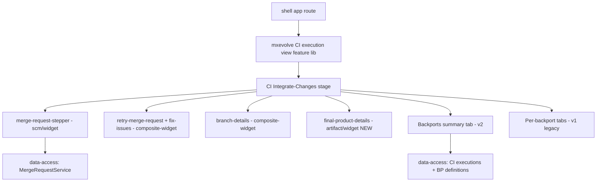

# Design — VAL-26642: CI / Build & Test Merge Step Migration

## Figma & Visual References
> File: MxEvolve (`8Z7emdDFkZapK3nmVP2HsA`). Open the node links in dev mode for spacing/colors/typography.

| Ref | What it shows | Used by slice |
|-----|---------------|---------------|
| [Merge Review](https://www.figma.com/design/8Z7emdDFkZapK3nmVP2HsA/MxEvolve?node-id=9769-56784&m=dev) (9769-56784) | Merge step — under-review state | S2 |
| [Merge Review (alt)](https://www.figma.com/design/8Z7emdDFkZapK3nmVP2HsA/MxEvolve?node-id=9769-57183&m=dev) (9769-57183) | Merge step — review variant | S2 |
| [Merge](https://www.figma.com/design/8Z7emdDFkZapK3nmVP2HsA/MxEvolve?node-id=10333-56610&m=dev) (10333-56610) | Merge step — merged state | S2 |
| [Backports table](https://www.figma.com/design/8Z7emdDFkZapK3nmVP2HsA/MxEvolve?node-id=9769-57211&m=dev) (9769-57211) | v2 On-Demand Backport Executions table | S4 |
| Wiki [MVF/950870862](https://mxwiki.murex.com/confluence/spaces/MVF/pages/950870862) + imgs (`wiki-context/img1-3.png`) | FP failure state, legacy cherry-pick `@switch`, v2 backports design + Q&A | S3, S4, S5 |
| [Final Product Details](https://www.figma.com/design/8Z7emdDFkZapK3nmVP2HsA/MxEvolve?node-id=9969-144576&m=dev) (9969-144576) | New Final Product Details design (title + detail frames) | S3 |

## Architecture Overview
The CI merge step is migrated from the legacy MFE into the **domains/business-process** stack, mirroring
the already-migrated Upgrade Process. The new step is a standalone, signal-based stage component that
composes shared SCM and business-process widgets, adds a Final Product Details section, and preserves the
legacy (v1) and new (v2) backport experiences.

## Affected Modules
| Layer | Module | Path | Role |
|-------|--------|------|------|
| Frontend (new) | CI feature lib | `web/libs/domains/business-process/feature/src/lib/build-and-test-process` (NEW) | Hosts CI execution view + integrate-changes stage; legacy v1 backport code under a `legacy/` subfolder |
| Frontend (reuse) | business-process composite-widget | `web/libs/domains/business-process/composite-widget` | retry-merge-request, fix-issues, branch-details, merge-request-details-form |
| Frontend (reuse) | business-process ui | `web/libs/domains/business-process/ui` | stage-container, content-container, execution-alert-display |
| Frontend (reuse) | scm widget | `web/libs/domains/scm/widget` | merge-request-stepper, merge-configuration-dropdown, reviewers-autocomplete |
| Frontend (NEW) | Final Product Details widget | `web/libs/domains/artifact/widget` (`type:widget`, `scope:artifact`) | New FP details UI; consumed cross-domain by the CI feature; replaces legacy `features/artifact-manager` for new code |
| Frontend (NEW) | artifact final-product data-access | `web/libs/domains/artifact/data-access` | New final-product service + models (only factory-product exists today) |
| Frontend (NEW) | ag-grid backport tables | new CI feature lib (via shared ag-grid wrapper) | v2 backport executions + failed-to-launch definitions tables |
| Frontend (reuse) | data-access | `web/libs/domains/business-process/data-access` | send-changes-for-review, fix-issues services + CI execution fetch |
| Frontend (source/parity ref) | legacy CI MFE | `web/apps/ci-process-mfe/.../integrate-changes` | Source of behaviour to replicate; legacy backport code copied as-is |
| Frontend (template ref) | upgrade-process | `web/libs/domains/business-process/feature/src/lib/upgrade-process/integrate-changes-stage` | Authoritative structural template |

## Key Design Decisions
| # | Decision | Rationale | Alternatives considered |
|---|----------|-----------|-------------------------|
| 1 | Follow the **upgrade-process (domains)** pattern, not the validation-process (features MFE/NgRx) pattern. | User directive + upgrade-process is the modern target; validation-process is the older generation being replaced. | Mirror validation-process MFE/NgRx — rejected (older arch). |
| 2 | Reuse `mxevolve-merge-request-stepper`, `mxevolve-retry-merge-request`, `mxevolve-fix-issues`, `mxevolve-branch-details` as-is. | Identical to Upgrade merge step; minimizes new code. | Re-implement — rejected (duplication). |
| 3 | Add Final Product Details by passing an **optional `finalProductId`** input into the stage; render a **new `domains/artifact/widget` Final Product Details component** (backed by a new final-product service in `domains/artifact/data-access`) when present and `willPublishFinalProduct`. | Wiki Q1 confirms it's the same UI as the Tag stage (different product), but no domains FP component exists and the legacy one is `type:legacy`. Final-product belongs to the artifact domain. | Reuse legacy `features/artifact-manager` component — rejected (Nx boundary: domains→legacy); put it in `business-process/composite-widget` — rejected (wrong domain). |
| 4 | Keep two backport renderings driven by `ciVersion`: v2 = summary tab; v1 = legacy per-backport tabs **copied as-is into a `legacy/` subfolder, de-remoted**. | Wiki: legacy processes "keep design as is and copy code for backward compatibility"; remote MFE loading is being removed. | Unify v1/v2 or keep remote loading — rejected. |
| 5 | v2 Backports: keep the **two existing tables** (executions w/ status; failed-to-launch definitions by definition name) rendered with **ag-grid** (shared wrapper); move the deleted/missing-definition **error banner ABOVE** the tables. | Matches current behaviour + new Figma (9769-57211) + img3. | Add a brand-new table — rejected (tables already exist). |
| 6 | No feature flags / authorization added to the merge step; gating stays state-based; route protection stays at host. | Matches current MFE behaviour exactly (merge step has none). | Add flags/guards — rejected (changes behaviour). |

## Data & Contract Changes
- **None.** Consumes existing gateway endpoints unchanged:  - `GET .../scm/merge-configurations/{mergeJobId}` (merge request)
  - `POST .../user-input/send-changes-for-review`, `/reopen-merge-request`, `/fix-integration-issues`, `/commits-cherry-picked`, `/repush-backport-merge-job`
  - CI executions fetch + business-process definitions (for backport summary).
- Rendering driven by existing execution fields: `ciVersion`, `backportRequested`, `willPublishFinalProduct`, `finalProductId`, `backportFinalProductId`, `integrateDestinationBranch`.

## Existing Patterns To Reuse
- Standalone components; `input()` / `input.required()`; `rxResource` for fetch; `computed()`/`signal()`; `takeUntilDestroyed`; no `ngOnInit` fetch pattern; no NgRx.
- Layout via `mxevolve-stage-container` + `mxevolve-business-process-content-container` (header/footer slots).
- Lazy `loadComponent` route in `web/apps/shell/.../business-process-routing.module.ts`.
- Cross-domain imports via barrels: `@mxevolve/domains/business-process/{feature,composite-widget,ui,data-access,util}`, `@mxevolve/domains/scm/widget`.

## Risks & Mitigations
- **Legacy v1 backport parity drift** → copy code as-is into `legacy/`, de-remoted; add unit tests asserting each `cherryPickStatus` branch.
- **Final product states (in-progress/`-` placeholders/failure)** → cover all three states in the new domains FP component; mirror legacy behaviour.
- **No domains Final Product component exists** + legacy one is `type:legacy` → build a new `domains/artifact/widget` FP component + `domains/artifact/data-access` final-product service (shareable with the future Tag-stage migration); avoids domains→legacy Nx violation.
- **De-remoting the backport MR view** (legacy loaded it from scm-mfe via `RemoteComponentInjectorService`) → copy the underlying view as-is into `legacy/`; verify it renders without the remote injector.
- **validation-process confusion** → documented; anchor on upgrade-process only.
- **ag-grid for v2 tables** → use the shared ag-grid wrapper; keep the two-table + banner-above layout matching Figma 9769-57211.
