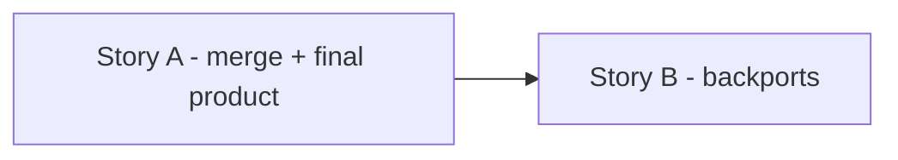
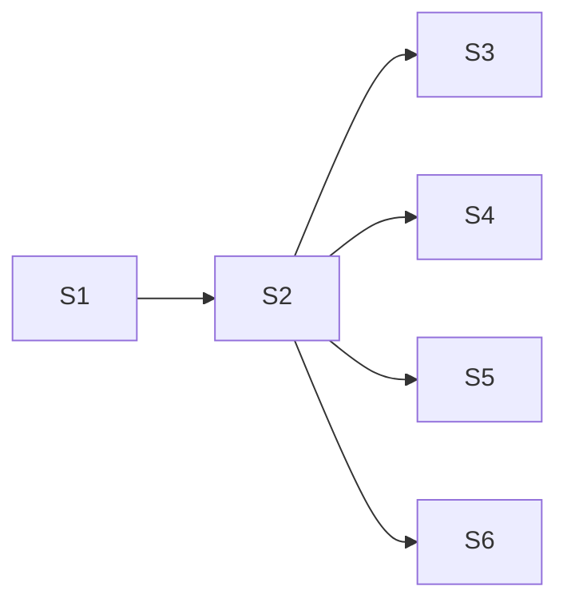

# Story Map — VAL-26642: CI / Build & Test Merge Step

> Suggestions only. This does NOT create or modify Jira tickets.

## Grouped Stories (execution units)
The 6 slices below are grouped into **2 implementable stories**. Each story migrates all its consumed
data-access into the new domains architecture **with unit tests + contract (pact) tests** — never depending on legacy.

| Story | Slices | Summary | Doc |
|-------|--------|---------|-----|
| **Story A** | S1 + S2 + S3 + S6 | Scaffold + Merge tab + Final Product Details + decision/alerts | [stories/story-A-merge-and-final-product.md](stories/story-A-merge-and-final-product.md) |
| **Story B** | S4 + S5 | Backports v2 (ag-grid) + v1 legacy (de-remoted) | [stories/story-B-backports.md](stories/story-B-backports.md) |

> **Story B depends on Story A** (the CI execution view + integrate-changes stage shell from S1 must exist first).

## Suggested Story Slices
| # | Slice | Summary | Layer(s) | Suggested owner/team | Required reviewers |
|---|-------|---------|----------|----------------------|--------------------|
| S1 | Scaffold `build-and-test-process` feature lib + stage shell | Create CI execution view + integrate-changes stage shell under `domains/business-process/feature/src/lib/build-and-test-process`, wire route in shell, fetch CI execution (rxResource), expose `ciVersion`/`backportRequested`/`willPublishFinalProduct`/`finalProductId`. | FE | ATLANTIS web | BP/SCM owners |
| S2 | Merge tab (parity with Upgrade) | Compose merge-request-stepper + branch-details + retry-merge-request + fix-issues + send-for-review/reopen; replicate state-based button gating (`areActionsDisabled`). | FE | ATLANTIS web | BP/SCM owners |
| S3 | New Final Product Details widget (`domains/artifact`) | Build a new FP widget in `domains/artifact/widget` + final-product service in `domains/artifact/data-access` (NOT the legacy `features/artifact-manager` one); render when `willPublishFinalProduct` + `finalProductId`; in-progress (`-` placeholders) + success + failure states; wire optional `finalProductId` into the stage. | FE | ATLANTIS web | BP / artifact owners |
| S4 | Backports — v2 summary tab (ag-grid) | "Backports" tab: keep the two tables (backport executions w/ status; failed-to-launch definitions by definition name) using **ag-grid** (shared wrapper); move deleted/missing-definition error **banner above** the tables; preserve info alert. | FE | ATLANTIS web | BP owners |
| S5 | Backports — v1 legacy tabs (copy as-is, `legacy/`) | Copy per-backport tabs into a `legacy/` subfolder, **de-remoted**: cherry-pick `@switch` (in-progress/manual/picked), manual-cherry-pick, backport MR view (no remote injector), repush backport action, per-backport branch details + final product. | FE | ATLANTIS web | BP/SCM owners |
| S6 | Decision/Stopped states + alerts | integrate-changes-decision (Stopped + requester), backport decision-maker, info alerts wording for v1/v2. | FE | ATLANTIS web | BP owners |

## Dependency Order

## Parallelization Opportunities
- After **S2** lands, **S3 / S4 / S5 / S6** are largely independent and can proceed in parallel (different sub-sections of the stage).
- **S5** (legacy copy-as-is) is the riskiest for parity but has no dependency on S3/S4.

## Per-Slice Test Obligations & Definition of Done
### S1 — Scaffold
- **Tests:** unit test execution-view renders stage by status; fetcher/mapper maps CI fields; route resolves.
- **DoD:** CI execution view loads via shell route; integrate-changes stage shell renders; lint + Nx boundaries pass.

### S2 — Merge tab
- **Tests:** stepper sub-steps render; buttons enabled/disabled per state; send-for-review/reopen/fix-issues call correct services.
- **DoD:** Visual + behavioural parity with Upgrade merge step; all merge actions work.

### S3 — Final Product
- **Tests:** new `domains/artifact/widget` FP component shown only when `willPublishFinalProduct` + `finalProductId`; in-progress shows `-` placeholders; failure shows error banner; data-access service fetch covered.
- **DoD:** Behaviour matches legacy final-product UI; lives in `domains/artifact`; no dependency on `type:legacy` artifact-manager.

### S4 — Backports v2
- **Tests:** both ag-grid tables render; executions table shows status; failed-to-launch table shows definition names; deleted-definition banner appears **above** the tables with ids; info alert wording.
- **DoD:** Matches new Figma (9769-57211 / img3) + same behaviour as current code.

### S5 — Backports v1
- **Tests:** each `cherryPickStatus` branch renders correct sub-component; repush gating; cherry-pick-done flow; renders without remote injector.
- **DoD:** Behaviour identical to legacy MFE; copy-as-is under `legacy/`, de-remoted, verified.

### S6 — Decision/alerts
- **Tests:** Stopped state shows requester; alert text matches v1/v2.
- **DoD:** Parity with legacy.
