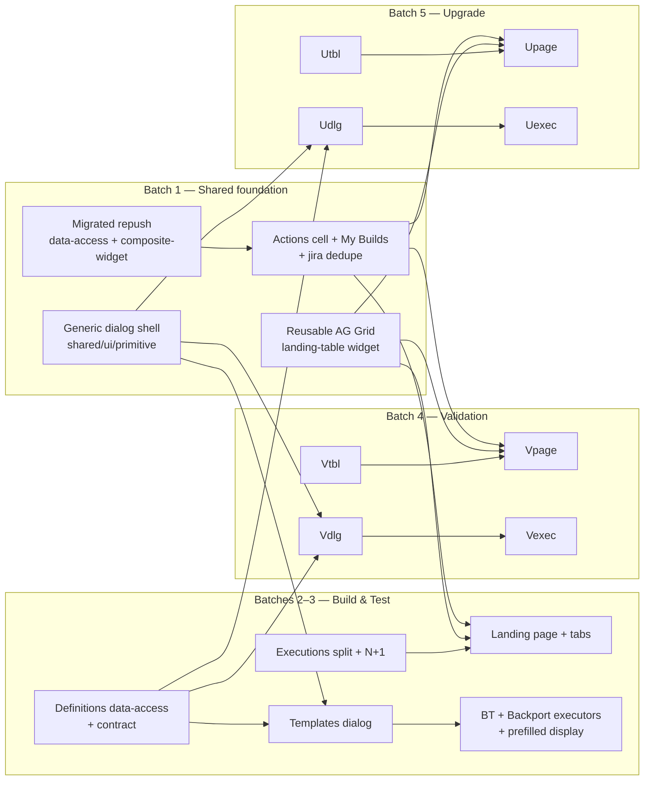

# VAL-27132: [UI/UX] Activities Landing Pages — Implementation Plan

## Planning Complete
This epic adds **three new Activity Landing Pages** (Build & Test, Validation, Upgrade) under the new
Nx domain architecture: a first-position nav tab each, **Active Runs + Show History** AG Grid tables
(backend-paginated, **column-filter parity with the current table**, sticky Actions = Abort + Repush on
**both** tables — abort disabled on terminal history rows, My Builds filter, **no free-text Search box**,
N+1 jira-details fixed), and a **generic activity-agnostic multi-page dialog** to start runs (Page 1 =
Process Templates filtered by family + **dynamically derived** Sub-Family dropdown; Page 2 = per-family
**Reactive Forms** executor with prefilled-expand + non-prefilled inputs). It is **additive** — legacy
pages/services/feature-flags are untouched; all new UI is built **greenfield in new-arch** (no legacy
component import — the already-migrated abort component is reused). Build & Test ships as a usable slice
first, then Validation, then Upgrade.
- ✅ All 16 acceptance criteria mapped to steps.
- ⚠️ Large epic — 19 steps / 5 batches (at the schedule cap). Build & Test (batches 1–3) is independently shippable.
- 🔁 Revised 2026-06-30 from spec-review PR #11556 (8 decision-level changes — see `spec.md` › Changes since last review).

## Summary
We are building new **Activity Landing Pages** as a UI re-skin + clean-code migration onto the new
architecture, **without changing any behaviour**. Each activity's page reuses one **reusable AG Grid
landing-table widget** configured per activity (columns, filters, endpoint, page size) and renders two
instances — **Active Runs** (`running` + `pending_input` + `aborting`) and **Show History** (other
statuses) — each a separate backend-paginated query (`statuses` filter). A sticky **Actions** column on
**both** tables reuses the already-migrated new-arch `mxevolve-execution-abort-button` and a new-arch repush
opener; on terminal **history** rows the abort is **disabled**. The tables have **no free-text Search box**
(filtering is column-based only — a search box would need backend changes) and must keep the **same column
filters as the current table** for the columns we have today. The legacy **My Executions** toggle becomes a
**My Builds** widget setting `ownerPhrase`. The per-page duplicate `issue-tracking/.../project-details`
calls are **de-duplicated** to one shared call.

Starting a run uses a new **generic, activity-agnostic multi-page dialog** in `@mxevolve/shared/ui/primitive`
(single instance, internal page navigation + back, no modal-on-modal). The shell knows nothing about the
activities: Page 2's title (= selected template name) and the collapsible "{name} Details" prefilled panel
are supplied by the consumer via **input signals (`input()`/`input.required()`) and content projection** —
never legacy `@Input()`. **Page 1** loads `definitions?extendable=false&executable=true` once (not
paginated), UI-filters by `family.id`, offers a **Sub-Family** dropdown (rendered with the shared
`mxevolve-single-select-dropdown`, **dynamically derived from each definition's readable `name`** for all
three activities), paginates to size 5, and a per-row **Run**. **Page 2** renders a **per-family executor**
(Build & Test, Backport, Validation, Upgrade) rebuilt with **signals + Angular Reactive Forms** — no
`viewchild`/`initializeForm`, **not** Signal Forms (still dev-preview) — with an **expand-arrow** showing
**prefilled** definition fields (new design-language display component replacing `input-view-resolver`) and
a form below showing only **non-prefilled** fields (display logic migrated from the legacy `definition-input`
`shouldShow` rules + `InputAccessMode`).

Key decisions: the dialog is a pure presentational shell (pages projected by the consumer, respecting the
`scope:shared` rule); the migrated definitions/eligibility services get **unit + contract (Pact)** tests;
all component→service calls use **rxResource**; AG Grid uses the **serverSide** row model with **custom
header filter controls** mapped to the same query params; all UI is built **greenfield in new-arch** — the
four leaf input selectors are **rebuilt as new `business-process/ui` components** on the shared
`mxevolve-single-select-dropdown` / `mxevolve-multiselect-dropdown` (no legacy `libs/ui/inputs` import).

Main risks: 1:1 filter/column parity on AG Grid serverSide vs the current table; not losing any executor
field across the Reactive-Forms migration; preserving the feature-flag-gated fields exactly.

## Current State Analysis
### Key Discoveries
- New-arch BP domain libs exist: `feature`, `composite-widget`, `widget`, `ui`, `data-access`, `util`
  (`@mxevolve/domains/business-process/*`); `scope:shared` may only depend on `scope:shared`.
- Executions services already exist per activity (`BuildAndTestExecutionsService` /
  `ValidationProcessListingService` / `UpgradeProcessListingService`) and accept
  `page/pageSize/statuses/ownerPhrase/hidden/sort` — reused for the active/history split.
- Definitions endpoint is **NOT** paginated and has **no** family filter param → filter `family.id` on UI.
  Family ids: `user-story-build-and-test`, `master-validation`, `binary-upgrade`; sub-families via
  `sourceDefinitionId` (backend-verified in `families.yaml` / `base-definitions.yaml`). Each definition
  also carries a human-readable `name` (and `family.name`) serialized through `DefinitionApiModel.name`
  → web `BusinessProcessDefinition.name`, which drives the Sub-Family dropdown labels for all activities.
- AG Grid serverSide template: `scm/widget/.../paginated-commits-difference`. rxResource templates:
  `composite-widget/.../branch-details`, `.../keep-environments-table`. No generic multi-page dialog
  exists yet → greenfield. Executors use **Angular Reactive Forms** (`ReactiveFormsModule`); Signal Forms
  (`@angular/forms/signals`) are **not** used (still dev-preview — decision PR #11556).
- Shared common dropdowns `mxevolve-single-select-dropdown` / `mxevolve-multiselect-dropdown` exist at
  `@mxflow/ui/mxevolve-dropdown` — used for all single/multi-selects. The already-migrated new-arch abort
  component lives at `business-process/composite-widget/.../execution-abort-button` (reused). The four leaf
  input selectors are **rebuilt fresh** in `business-process/ui` (no legacy `libs/ui/inputs` import).
- Legacy executors/inputs use `@ViewChild … initializeForm(projectId, definition.providedInputs)`; field
  visibility = `definition-input` `shouldShow` (`forceShow || ACCESS_ALL || (ACCESS_INVALID && invalid)
  || (ACCESS_EMPTY_OPTIONAL && empty)`). Full per-family field lists captured in `context.md`.
- Repush opener is legacy (`web/apps/shell/.../business-process-execution-repush-modal-opener`) with an
  eligibility gate then per-family modal → **migrate** to new arch. Abort button already migrated.

### Boundary Test Matrix
- **Web ↔ business-process-definition-service** (`definitions`): migrate `BusinessProcessDefinitionService`
  to data-access — add a Pact **consumer** contract test (web side: none found new-arch; legacy at
  `web/libs/features/business-process/.../business-process-definition.service.spec.ts`). Provider side:
  `business-process-definition-service` `DefinitionController` (no web change required).
- **Web ↔ business-process-execution-service** (`executions/eligibility`): migrate
  `BusinessProcessExecutionEligibilityService` to data-access — add a Pact consumer contract test.
- Executions GET services already exist in data-access (reused; no contract change).

## Desired End State
Three new tabs/routes render the landing pages with full legacy behaviour preserved (verify against the
legacy CI/validation/upgrade tables column-by-column and filter-by-filter), the Build dialog starts runs
end-to-end per family, and no legacy page/route/service/flag is altered. `npx eslint` passes on all new
folders; Jest unit tests + migrated-service contract tests pass.

## What We're NOT Doing
- Removing/altering legacy pages, routes, services, MFEs, or feature flags (additive only).
- The summary "Pending Input / Running" **cards**, the templates-dialog **search** box, and the executor
  "additional settings" panel.
- A per-table **free-text Search box** (column-based filters only — a search box would need backend changes).
- Backend changes (all endpoints exist).
- **Signal Forms** (`@angular/forms/signals`) — executors use Angular **Reactive Forms** instead.
- Importing/reusing any **legacy UI components** — leaf selectors are rebuilt new-arch (the already-migrated
  new-arch abort component is reused; that is not legacy reuse).

## Acceptance Criteria Coverage
| # | Acceptance Criterion | Steps | Verification |
|---|----------------------|-------|--------------|
| AC-1 | New first-position nav tab + route per activity | 6, 13, 17 | Tabs (Build & Test → Validation → Upgrade) appear before "Business Processes"; routes load |
| AC-2 | Active Runs + Show History tables (status split) | 3, 6, 13, 17 | Active shows running/pending_input; History shows rest |
| AC-3 | AG Grid + backend pagination, page size 5/10, legacy columns/order | 3, 5, 6, 12, 13, 16, 17 | Column order vs legacy; page sizes |
| AC-4 | Every legacy filter + sort preserved | 3, 6, 13, 17 | Filter-by-filter parity vs legacy |
| AC-5 | My Builds toggle (ownerPhrase = user) | 4, 6, 13, 17 | Toggle filters to current user |
| AC-6 | Sticky Actions: Abort (reuse) + Repush (new-arch), both tables | 2, 4, 6, 13, 17 | Abort/repush work; column sticky on Active + History (history abort disabled) |
| AC-7 | N+1 jira-details dedupe | 4, 5 | Single project-details call per page |
| AC-8 | Generic multi-page dialog (back, no modal-on-modal) | 1, 8, 14, 18 | One dialog instance; internal nav + back |
| AC-9 | Dialog Page 1 templates (filter family, paginate 5) | 7, 8, 14, 18 | One definitions call; UI filter+paginate |
| AC-10 | Sub-Family dropdown (dynamically derived from definition.name, all activities) + Run | 8, 14, 18 | Dropdown filters; Run opens Page 2 |
| AC-11 | Page 2 per-family executor, Reactive Forms, no field lost | 9, 10, 15, 19 | Field-by-field vs legacy executors |
| AC-12 | Expand-arrow prefilled display + non-prefilled inputs | 11, 15, 19 | Prefilled shown on expand; form shows rest |
| AC-13 | Run/Build submits to execute endpoint; error handling | 9, 10, 15, 19 | Execute success + toast on error |
| AC-14 | user-story-validation + jira-user-story-archival flags preserved | 9, 15 | Flag on/off behaviour matches legacy |
| AC-15 | No existing functionality removed/changed (additive) | all | Legacy routes/services untouched; eslint/build |
| AC-16 | Migrated services: unit + contract tests; rxResource usage | 2, 5, 7, 12, 16 | Pact tests pass; no raw subscribe |

## Implementation Approach
Build the **shared foundation** first (dialog shell, migrated repush, reusable table widget, actions +
My Builds + jira dedupe), then deliver **Build & Test** as a full vertical slice (tables → dialog →
executors), then replicate for **Validation** and **Upgrade** by configuring the shared widgets and
migrating each family's executor. Vertical-slice ordering lets Build & Test ship after batch 3.

## Dependency Graph
- Step 1 (independent) — generic dialog shell
- Step 2 (independent) — migrated repush
- Step 3 (independent) — reusable AG Grid landing-table widget
- Step 4 (depends on 2, 3) — actions cell + My Builds + jira dedupe
- Step 5 (depends on 4) — Build & Test executions data-access split + N+1
- Step 6 (depends on 3, 4, 5) — Build & Test landing page + tab
- Step 7 (independent; needed by 8) — migrate definitions data-access (+contract)
- Step 8 (depends on 1, 7) — Build & Test templates dialog (Page 1) + shared `deriveSubFamilies` helper
- Step 9 (depends on 1, 8, 11) — Build & Test executor (Page 2)
- Step 10 (depends on 1, 8, 11) — Backport executor (Page 2)
- Step 11 (depends on 1) — rebuild shared leaf selectors (new-arch) + BT/backport prefilled display + non-prefilled logic
- Step 12 (depends on 4) — Validation executions data-access split
- Step 13 (depends on 3, 4, 12) — Validation landing page + tab
- Step 14 (depends on 1, 7, 8) — Validation templates dialog (Page 1; reuses shared helper)
- Step 15 (depends on 1, 11, 14) — Validation executor (Page 2) + prefilled display + flag-gated field
- Step 16 (depends on 4) — Upgrade executions data-access split
- Step 17 (depends on 3, 4, 16) — Upgrade landing page + tab
- Step 18 (depends on 1, 7, 8) — Upgrade templates dialog (Page 1; reuses shared helper)
- Step 19 (depends on 1, 11, 18) — Upgrade executor (Page 2) + prefilled display

## Execution Schedule
| Batch | Steps | Rationale |
|-------|-------|-----------|
| 1 | Steps 1–4 | Shared foundation: dialog shell, migrated repush (+contract), reusable AG Grid table, actions + My Builds + jira dedupe. All additive/dead until wired. |
| 2 | Steps 5–6 | Build & Test executions split + N+1 fix, then landing page + first nav tab. Ships the first table page. |
| 3 | Steps 7–11 | Build & Test Build dialog: migrate definitions data-access (+contract), templates dialog (Page 1), BT + Backport executors (Page 2), prefilled display. **Build & Test fully usable after this batch.** |
| 4 | Steps 12–15 | Validation activity: executions split, landing page + tab, templates dialog, validation executor (incl. flag-gated field) + prefilled display. |
| 5 | Steps 16–19 | Upgrade activity: executions split, landing page + tab, templates dialog, upgrade executor + prefilled display. |

> Build & Test (batches 1–3) is an independently shippable vertical slice; Validation (batch 4) and
> Upgrade (batch 5) can be deferred to follow-up stories if scope must be trimmed.

## Steps
| # | Step | File | Risk | Depends on | Parallel with | Status |
|---|------|------|------|------------|---------------|--------|
| 1 | Generic multi-page dialog shell (`shared/ui/primitive`) | `steps/step-1.md` | Med | none | 2, 3, 7 | [x] |
| 2 | Migrate repush opener + eligibility service (+contract) | `steps/step-2.md` | High | none | 1, 3, 7 | [x] |
| 3 | Reusable AG Grid landing-table widget | `steps/step-3.md` | High | none | 1, 2, 7 | [x] |
| 4 | Actions cell (abort+repush) + My Builds widget + jira dedupe | `steps/step-4.md` | Med | 2, 3 | 7 | [x] |
| 5 | Build & Test executions data-access split + N+1 fix | `steps/step-5.md` | Med | 4 | — | [x] |
| 6 | Build & Test landing page + first nav tab/route | `steps/step-6.md` | Med | 3, 4, 5 | — | [x] |
| 7 | Migrate definitions data-access service (+contract) | `steps/step-7.md` | High | none | 1, 2, 3 | [x] |
| 8 | Build & Test templates dialog (Page 1) + shared deriveSubFamilies helper | `steps/step-8.md` | Med | 1, 7 | — | [x] |
| 9 | Build & Test definition executor (Page 2, Reactive Forms) | `steps/step-9.md` | High | 1, 8, 11 | 10 | [x] |
| 10 | Backport definition executor (Page 2, Reactive Forms) | `steps/step-10.md` | High | 1, 8, 11 | 9 | [x] |
| 11 | Shared leaf selectors (new-arch) + BT/backport prefilled display + non-prefilled logic | `steps/step-11.md` | Med | 1 | — | [x] |
| 12 | Validation executions data-access split | `steps/step-12.md` | Med | 4 | 16 | [x] |
| 13 | Validation landing page + nav tab/route | `steps/step-13.md` | Med | 3, 4, 12 | — | [x] |
| 14 | Validation templates dialog (Page 1) | `steps/step-14.md` | Med | 1, 7, 8 | 18 | [x] |
| 15 | Validation executor (Page 2) + prefilled + flag-gated field | `steps/step-15.md` | High | 1, 11, 14 | — | [x] |
| 16 | Upgrade executions data-access split | `steps/step-16.md` | Med | 4 | 12 | [x] |
| 17 | Upgrade landing page + nav tab/route | `steps/step-17.md` | Med | 3, 4, 16 | — | [x] |
| 18 | Upgrade templates dialog (Page 1) | `steps/step-18.md` | Med | 1, 7, 8 | 14 | [x] |
| 19 | Upgrade executor (Page 2) + prefilled display | `steps/step-19.md` | High | 1, 11, 18 | — | [x] |

## Test Obligations (summary; per-step detail in step files)
- **Contract (Pact) tests:** Step 2 (eligibility service), Step 7 (definitions service).
- **Unit tests (Jest):** every step adds/updates `.spec.ts` for new components/services/widgets.
- **Targeted commands:** infer from project (`web/` Nx Jest). See `.github/skills/web-unit-test-runner`
  and `.github/skills/local-pact-verify` for the correct local invocation; no `devo/test-policy.md` found.

## Manual Verification
Open each new tab; compare Active/History columns, order, filters, sort, page sizes against the legacy
table; toggle My Builds; abort + repush a run; open the Build dialog, filter templates by sub-family,
Run a template, expand prefilled fields, fill non-prefilled inputs, Build; confirm legacy pages unchanged.
