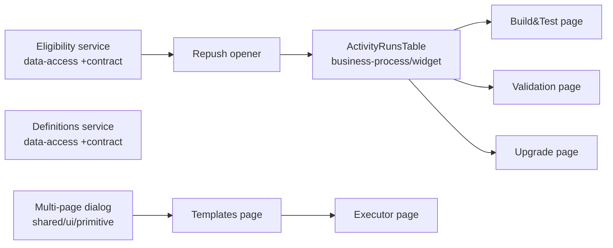

# VAL-27132: [UI/UX] Activities Landing Pages — Spec

## Changes since last review
_Last reviewed: captured-design version (2026-06-30) — spec-review PR #11556 raised 8 decision-level changes, applied below._
- 2026-06-30 — **Applied 8 decision-level changes from spec-review PR #11556** (revision):
  1. **Active Runs status set** now includes **aborting** (Active = {running, pending_input, aborting};
     History = everything else). [Overview, Decisions, Key Shapes, Steps 5/6/12/13/16/17]
  2. **Removed per-table free-text Search box** from both Active and History tables (would need backend
     changes) — **column-based filters only**; the My Builds toggle stays. [captured-design, Key Shapes,
     Steps 3/6/13/17]
  3. **Executors use Angular Reactive Forms**, not Signal Forms (`@angular/forms/signals` still dev-preview).
     [Executors decision, Key Shapes, Steps 9/10/15/19]
  4. **History table also has a sticky Actions column** — abort **disabled** on terminal history rows
     (reused abort component handles the disabled state); resolves the Active-only Actions open item.
     [Overview, captured-design, Steps 4/6/13/17]
  5. **Executions-endpoints assumption confirmed** ✅ (three endpoints + shared
     `page/pageSize/statuses/ownerPhrase/hidden/sort` shape exist). [Assumptions]
  6. **Column-filter parity with the current table is now a hard requirement** (not just an assumption).
     [Assumptions, Steps 3/6/13/17]
  7. **No legacy reuse — greenfield**: the four leaf selectors are rebuilt as new `business-process/ui`
     components; all single/multi-selects use the shared `mxevolve-single-select-dropdown` /
     `mxevolve-multiselect-dropdown`; the **already-migrated new-arch abort component is reused** (not
     legacy); repush opener + family modals built fresh; data-access services stay as planned (new files vs
     same endpoints). The three "cross old/new import" assumptions are resolved. [Decisions, Key Shapes,
     Where-the-code-goes, Steps 2/9/10/11/15/19]
  8. **Generic dialog clarified**: the shell is activity-agnostic; Page 2 title + collapsible "{name}
     Details" panel are supplied by the consumer via **`input()` signals + content projection**, never legacy
     `@Input()`. [Decisions, Assumptions, Step 1]
- 2026-06-30 — **Captured real Figma + Jira designs** (previously "design language only / LOW confidence"):
  the actual landing-page frames, header bar, and both dialog pages are now on disk under
  `devo/feature/VAL-27132/designs/` and their concrete layout/columns/dialog chrome are baked into
  `context.md` (Design References + Visual & Layout Details), this spec, and Steps 3, 6, 8–11, 13–15, 17–19.
  Key specifics now fixed: visible **Active Runs** columns (Name · Status · User Stories ID · Current Step ·
  Step Details · Type · Branch Name · **Actions**, sticky right with repush+abort icons), **Inactive Runs**
  columns (Name · Status · User Stories ID · Branch Name · Type · Owner · Start Date, **no Actions column**),
  status badge colors, the header **My Build toggle + Build button**, breadcrumb row, the **Show History ⌄**
  toggle, the templates dialog ("Build & Test Available Templates", Select Sub-Activity, Name/Description,
  per-row circle Run), and the executor dialog chrome (back chevron + template-name title, collapsible
  "{name} Details" prefilled panel, User Story ID input + blue "+" add, centered Build). Column **completeness
  is still reconciled against legacy** (Figma may omit columns/filters) — no behaviour change.
- 2026-06-30 — **Nav tab order fixed** (open item resolved): the three activity tabs are **Build & Test
  Activity → Validation Activity → Upgrade Activity**, all before "Business Processes". Baked into Steps 6, 13, 17.
- 2026-06-30 — **Sub-Family dropdown derived dynamically for ALL activities** (open item resolved): the
  definitions response carries a human-readable `name` per definition (verified in `families.yaml` /
  `base-definitions.yaml` → `DefinitionApiModel.name` → web `BusinessProcessDefinition.name`), so the
  hardcoded Build & Test list is dropped in favour of a shared `deriveSubFamilies` helper used by all three
  dialogs. Affects Steps 8, 14, 18.
- First version.

## Overview
We are adding three new **Activity Landing Pages** — **Build & Test**, **Validation**, and **Upgrade** —
each reachable from a new navigation tab placed first (before "Business Processes"). Each page shows that
activity's runs in two tables: **Active Runs** (running / pending input / **aborting**) and a **Show
History** table for everything else, keeping the **same columns and the same column filters as the current
table**, plus sorting and pagination, a **My Builds** filter, and per-row **Abort** / **Repush** actions in
a sticky column on **both** tables (abort is **disabled** on terminal history rows). The tables have **no
free-text Search box** — filtering is column-based only. From the same page users can **start a new run**
through a single **generic, activity-agnostic multi-page dialog**: pick a Process Template (filtered by
activity, with a Sub-Family dropdown), then fill the run inputs and launch — without leaving the dialog.

This is a **re-skin and clean-code migration onto the new architecture, not a behaviour change**. Existing
pages remain; everything here is added as new routes and components built **greenfield in the new
architecture** (no legacy UI component is imported — the already-migrated new-arch abort component is
reused), and all current functionality (filters, authorization, feature flags, services, error handling) is
preserved. It also fixes a known performance bug (duplicate background calls when loading the Build & Test
table).

The wiki fully specifies the **Build & Test** flow; **Validation** and **Upgrade** are built to the **same
full parity** by reusing the shared building blocks and migrating each activity's run-input form (with
**Angular Reactive Forms**).

**Captured-design specifics (2026-06-30 — see `context.md` › Visual & Layout Details and the frames under
`devo/feature/VAL-27132/designs/`):** the top nav lists **Build & Test → Validation → Upgrade** before the
existing tabs with a breadcrumb above the title; the header places a **My Build toggle** immediately left of
the primary **Build** button. **Active Runs** shows a **column-settings gear** (no Search box) and the
columns **Name · Status · User Stories ID · Current Step · Step Details · Type · Branch Name · Actions**
(Name + User Stories ID are links; Status is a colored badge; **Actions is sticky-right with repush + abort
icons**). A **Show History ⌄** button reveals **Inactive Runs** (its own gear, no Search box) with **Name ·
Status · User Stories ID · Branch Name · Type · Owner · Start Date** and **also a sticky Actions column**,
with **abort disabled** on the terminal history rows (decision PR #11556 — the reused abort component
handles the disabled state). Column **completeness and column-filter parity are reconciled against the
current table** — any column/filter the static Figma omits is kept. The Build dialog Page 1 ("Build & Test
Available Templates") has a Select Sub-Activity dropdown (shared `mxevolve-single-select-dropdown`) +
Name/Description rows with a per-row circle **Run**; Page 2 reuses the same dialog with a **back chevron +
template-name title**, a collapsible **"{name} Details"** panel for the prefilled fields, a **User Story ID**
input with a blue **"+" add**, and a centered **Build** submit. The summary **cards**, any free-text
**search** box, and the executor **Additional settings** expander remain **out of scope**.

## Chunks
| Chunk | Steps (→ detail) | Behaviour-safe? | Status |
|-------|------------------|-----------------|--------|
| chunk-1 Shared foundation | 1–4 → [s1](steps/step-1.md) · [s2](steps/step-2.md) · [s3](steps/step-3.md) · [s4](steps/step-4.md) | yes (dead code — new libs, unused until wired) | ✅ done |
| chunk-2 Build & Test tables | 5–6 → [s5](steps/step-5.md) · [s6](steps/step-6.md) | yes (new route) | ✅ done |
| chunk-3 Build & Test dialog + executors | 7–11 → [s7](steps/step-7.md) · [s8](steps/step-8.md) · [s9](steps/step-9.md) · [s10](steps/step-10.md) · [s11](steps/step-11.md) | yes (new route/components) | ✅ done |
| chunk-4 Validation activity | 12–15 → [s12](steps/step-12.md) · [s13](steps/step-13.md) · [s14](steps/step-14.md) · [s15](steps/step-15.md) | yes (new route) | ✅ done |
| chunk-5 Upgrade activity | 16–19 → [s16](steps/step-16.md) · [s17](steps/step-17.md) · [s18](steps/step-18.md) · [s19](steps/step-19.md) | yes (new route) | ✅ done |

> Chunks partition all 19 steps. Each is behaviour-safe to merge alone because it is additive: shared libs
> are dead code until wired (chunk-1), and each activity is a brand-new route that does not touch legacy.

## Key Shapes
```typescript
// NEW generic, activity-agnostic multi-page dialog shell (shared/ui/primitive)
// Page 2 title + collapsible "{name} Details" come from the consumer via input() signals + projection
class MultiPageDialogComponent { readonly visible = model<boolean>(); readonly header = input<string>(); open(pageId); goTo(pageId); back(); close(); }
[mxevolveMultiPageDialogPage]  // structural directive marking each projected page (no legacy @Input())

// NEW reusable AG Grid landing table (business-process/widget) — serverSide + custom filters + sticky actions
interface ActivityRunsPageRequest { page; pageSize; statuses: string[]; ownerPhrase?; sort; filters }
// active statuses = [running, pending_input, aborting]; history = everything else. No free-text Search box.
class ActivityRunsTableComponent<T> { loadPage: (req) => Observable<{ rows; total }>; /* column filters = same as current table */ }

// Actions cell on BOTH tables — REUSES the already-migrated new-arch abort component (not legacy)
mxevolve-execution-abort-button   // business-process/composite-widget/.../execution-abort-button (reused; disabled on history rows)
mxevolve-business-process-execution-repush-modal-opener  // new-arch repush opener (built fresh)

// Shared common dropdowns for ALL single/multi-selects (no raw PrimeNG p-select/p-multiselect)
mxevolve-single-select-dropdown | mxevolve-multiselect-dropdown   // @mxflow/ui/mxevolve-dropdown

// NEW data-access (new files vs same backend endpoints — not legacy reuse)
GET projects/{id}/business-process/definitions?extendable=false&executable=true → DefinitionApiModel[]   // NOT paginated; UI filters family.id; carries readable `name` + `family.name` (drives Sub-Family labels)
GET projects/{id}/business-process/executions/eligibility?familyId=&baseDefinitionId= → EligibilityResponse // repush gate

// Per-family executors built with Angular Reactive Forms (greenfield) — replace viewchild/initializeForm
FormGroup / FormControl + ReactiveFormsModule  // NOT @angular/forms/signals — BT, Backport, Validation, Upgrade

// Four shared leaf input selectors rebuilt new-arch (business-process/ui) on the shared dropdowns — no legacy import
mxevolve-business-process-infra-group-selector | …-scenario-definition-selector | …-notifications-recipients-input | mxevolve-user-story-input

// Family ids (UI filter keys, backend-verified)
user-story-build-and-test | master-validation | binary-upgrade   // sub-families via sourceDefinitionId
```



## Where the code goes
| File | Layer | New/Mod | Purpose |
|------|-------|---------|---------|
| `shared/ui/primitive/.../multi-page-dialog/*` | shared (api) | new | Generic multi-page dialog shell + page directive |
| `business-process/data-access/.../execution/business-process-execution-eligibility.service.ts` | data-access (api) | new | Repush eligibility + contract test |
| `business-process/data-access/.../definition/business-process-definition.service.ts` | data-access (api) | new | Templates list + contract test |
| `business-process/widget/.../activity-runs-table/*` | widget (api) | new | Reusable AG Grid table (serverSide, filters, sticky actions) |
| `business-process/widget/.../activity-runs-table/cells/run-actions-cell.component` | widget (api) | new | Actions cell on **both** tables: reused new-arch abort (disabled on history) + new-arch repush |
| `business-process/widget/.../my-builds-toggle/*` | widget (api) | new | My Builds toggle (ownerPhrase) |
| `business-process/composite-widget/.../repush-modal-opener/repush-modal-opener.component` | composite-widget | new | New-arch repush opener built fresh (+3 family repusher modals); no legacy import |
| `business-process/composite-widget/.../{build-and-test,backport,validation-process,upgrade-process}/executor/*` | composite-widget | new | Per-family **Reactive-Forms** executors (Page 2) |
| `business-process/composite-widget/.../*/templates-dialog/*` | composite-widget | new | Per-activity templates dialog (Page 1) |
| `business-process/ui/.../inputs/*` | ui | new | Five leaf input selectors rebuilt new-arch on the shared `mxevolve-single-select-dropdown` / `mxevolve-multiselect-dropdown` (no legacy import): `business-process-infra-group-selector.component`, `business-process-scenario-definition-selector.component`, `business-process-notifications-recipients-input.component`, `user-story-input.component` (Step 11) + `reviewers-autocomplete.component` (Step 10) |
| `business-process/ui/.../prefilled-inputs/build-and-test-prefilled-inputs.component` | ui | new | Per-family prefilled-field display (replaces input-view-resolver) |
| `business-process/util/.../definition-inputs/input-visibility.ts` | util | new | Field show/hide logic migrated from definition-input |
| `business-process/util/.../definition-inputs/validation-scope-visibility.ts` | util | new | `validationScopeStartCommitId` visibility resolver (flag-gated) |
| `business-process/feature/.../{build-and-test,validation-process,upgrade-process}/activity/*` | feature | new | Landing pages + routes |
| `apps/shell/.../app-layout/app-layout.component.ts` | api (shell) | mod | Add 3 first-position nav tabs |
| `apps/shell/.../app-layout/app-layout-routing.module.ts` | api (shell) | mod | Register 3 lazy activity routes |

## Decisions
- Generic dialog: **pure presentational, activity-agnostic shell in `shared/ui/primitive`**; pages projected
  by the consumer; Page 2 title + "{name} Details" panel via **`input()` signals + content projection**, never `@Input()`.
- Active/History: **two independent backend-paginated queries** with a `statuses` filter (Active = running /
  pending_input / **aborting**; History = the rest).
- Tables: **AG Grid serverSide + custom header filters** on **both** tables; **no free-text Search box**;
  **column-filter parity with the current table** (hard requirement); sticky Actions on Active + History.
- Repush: **built fresh in new-arch** (data-access service + composite-widget opener), no legacy component
  import; abort **reused from the already-migrated new-arch component** (disabled on terminal history rows).
- Templates: **one non-paginated definitions call**, UI filter by `family.id`; Sub-Family options
  **derived dynamically for all three activities** from each definition's readable `name` (shared
  `deriveSubFamilies` helper, rendered via the shared `mxevolve-single-select-dropdown`) — no hardcoded list.
- Executors: **per-family components with Angular Reactive Forms** (not Signal Forms — dev-preview) replacing
  the generic `definition-input` / `input-view-resolver`; **all UI greenfield in new-arch** — the four leaf
  selectors **rebuilt as new `business-process/ui` components** on the shared
  `mxevolve-single-select-dropdown` / `mxevolve-multiselect-dropdown` (no legacy `libs/ui/inputs` import).

## Assumptions
- **HIGH** — All three executions endpoints accept the same `page/pageSize/statuses/ownerPhrase/hidden/sort`
  shape incl. a `statuses` filter for the active/history split — ✅ confirmed (PR #11556 — endpoints + shape exist)
- **HIGH** — The active/history split via two `statuses`-filtered paginated calls is correct (vs one call) —
  wrong → table data/pagination incorrect — ✅ confirmed (decision #2)
- **MED** — Column-filter **parity with the current table** is now a **hard requirement** (not an assumption):
  the new tables keep the **same column filters as the current table** for the columns we have today — ✅ confirmed (PR #11556)
- **MED** — ~~Leaf sub-input selectors reused as-is from legacy `libs/ui/inputs` (cross old/new import)~~ —
  **RESOLVED**: no cross-import — the four selectors are **rebuilt new-arch** in `business-process/ui` on the shared dropdowns (change #7) — ✅ resolved
- **MED** — The generic dialog is **activity-agnostic**: Page 2 title (= definition name) + the collapsible
  "{name} Details" prefilled panel are supplied by the consumer via **`input()` signals + content projection**
  (never legacy `@Input()`), so the shell gains no Build/Validation/Upgrade coupling — ✅ confirmed (change #8)
- **LOW** — Real Figma + Jira designs are **captured** (2026-06-30; landing frames, header, both dialog
  pages on disk) and define concrete layout/columns/dialog chrome; only unspecified runtime states
  (loading/error/empty edge visuals) are extended from the existing design system — ✅ captured (column
  completeness + column-filter parity reconciled against the current table)
- **LOW** — Sub-Family labels derive readably from each definition's `name` for **all three activities** —
  ✅ confirmed (decision 2026-06-30; `DefinitionApiModel.name` / `BusinessProcessDefinition.name` present)

## Risks
- Filter/column parity drift (AG Grid vs the current PrimeNG table) — wrong filters return wrong rows —
  mitigate by field-by-field comparison vs the current tables in each landing-page step (parity is now a hard requirement).
- Lost executor field during the **Reactive-Forms** migration — a run input silently disappears — mitigate by
  field-by-field checklists captured in `context.md` + per-executor specs asserting field presence.
- Flag-gated fields (`user-story-validation-and-transition`, `jira-user-story-archival`) behaviour change —
  mitigate by porting the exact visibility/validation conditions + spec matrices (Steps 9, 15).
- Repush contract regression across the execution-service boundary — mitigate by the Pact contract test (Step 2).

## Acceptance Criteria Coverage
| # | Criterion | Steps | Verification |
|---|-----------|-------|--------------|
| AC-1 | First-position nav tab + route per activity | 6, 13, 17 | Tabs (Build & Test → Validation → Upgrade) appear before Business Processes |
| AC-2 | Active + History tables (status split) | 3, 6, 13, 17 | Active = running/pending_input/aborting; History = rest |
| AC-3 | AG Grid + backend pagination 5/10, columns/order | 3, 5, 6, 12, 13, 16, 17 | Column order + page sizes |
| AC-4 | Same column filters as the current table + sort | 3, 6, 13, 17 | Filter-by-filter parity (hard requirement) |
| AC-5 | My Builds (ownerPhrase = user) | 4, 6, 13, 17 | Filters to current user |
| AC-6 | Sticky Actions on both tables: Abort (reuse) + Repush (new-arch) | 2, 4, 6, 13, 17 | Actions work; sticky on Active + History (history abort disabled) |
| AC-7 | N+1 jira-details dedupe | 4, 5 | Single project-details call |
| AC-8 | Generic multi-page dialog | 1, 8, 14, 18 | One instance; internal nav + back |
| AC-9 | Dialog Page 1 templates (filter family, paginate 5) | 7, 8, 14, 18 | One call; UI filter + paginate |
| AC-10 | Sub-Family dropdown (dynamically derived from definition.name, all activities) + Run | 8, 14, 18 | Dropdown filters; Run → Page 2 |
| AC-11 | Page 2 per-family executor, Reactive Forms, no field lost | 9, 10, 15, 19 | Field-by-field vs legacy |
| AC-12 | Expand-arrow prefilled + non-prefilled inputs | 11, 15, 19 | Prefilled on expand; form shows rest |
| AC-13 | Run/Build submits to execute endpoint; error handling | 9, 10, 15, 19 | Execute + toast on error |
| AC-14 | Feature flags preserved | 9, 15 | Flag on/off matches legacy |
| AC-15 | No existing functionality removed/changed | all | Legacy untouched; eslint/build |
| AC-16 | Migrated services: unit + contract; rxResource | 2, 5, 7, 12, 16 | Pact pass; no raw subscribe |

---
## Decision rationale & log
_(drill-down — not front-of-page)_
- 2026-06-30 (revision) — **Captured real Figma + Jira designs**: pulled the actual landing-page frames, header
  bar, and both dialog pages (now under `devo/feature/VAL-27132/designs/`), superseding the earlier "design
  language only / LOW confidence" treatment. Baked the concrete layout into `context.md` (Design References +
  Visual & Layout Details), this spec, and Steps 3, 6, 8–11, 13–15, 17–19. Two design facts are now fixed as
  requirements: (a) **Active Runs** carries a sticky-right **Actions** column (repush + abort icons) while
  **Inactive Runs** has **no Actions** column; (b) the executor dialog uses internal back-navigation with a
  collapsible **"{name} Details"** prefilled panel and a blue **"+"** to add user stories (no magnifier). The
  Figma is **styling/layout authority only** — column/filter **completeness is reconciled against the legacy
  tables** (kept + flagged where the static design omits something), so this is not a behaviour change. The
  blank container frames (`figma-5626-106812`, `figma-5626-106941`, `figma-8687-49793`) are ignored. [all chunks]
- 2026-06-30 — Generic dialog in `shared/ui/primitive` (per developer): keeps it reusable across activities;
  rejected business-process placement (not reusable) and a new `shared/ui/dialog` lib (developer chose primitive). [chunk-1]
- 2026-06-30 — Two `statuses`-filtered paginated calls for Active/History: a single client-split call breaks
  backend pagination + per-table page sizes (5/10). [chunk-2,4,5]
- 2026-06-30 — AG Grid serverSide + custom header filters over AG Grid built-in filter UI: built-in UI risks
  diverging from the exact legacy filter behaviour that must be preserved. [chunk-1]
- 2026-06-30 — Repush migrated (not copied) per developer: legacy opener becomes new-arch data-access +
  composite-widget with a contract test; rejected verbatim copy (would carry legacy smells + no contract). [chunk-1]
- 2026-06-30 — ~~Sub-Family hardcoded for Build & Test (req #10) but derived from `sourceDefinitionId` for
  Validation/Upgrade (developer)~~ **SUPERSEDED 2026-06-30 (revision)** — now derived dynamically for all
  three activities from `definition.name` (see revision entry below). [chunk-3,4,5]
- 2026-06-30 — Per-family Signal-Forms executors replace generic `definition-input`/`input-view-resolver`:
  only 3 families exist (sub-families near-identical except backport), so the generalization earned nothing;
  rejected keeping the generic component. [chunk-3,4,5]
- 2026-06-30 — Full parity for all 3 activities (developer "largest parity"): Validation/Upgrade extrapolate
  the Build & Test architecture; rejected Build-&-Test-only and read-only Val/Upg pages. [chunk-4,5]
- 2026-06-30 (revision) — **Nav tab order fixed**: Build & Test Activity → Validation Activity → Upgrade
  Activity, all before "Business Processes" (developer decision, resolves the open "tab order" item).
  Concrete insertion order baked into Steps 6 (first), 13 (after Build & Test), 17 (after Validation).
  [chunk-2,4,5]
- 2026-06-30 (revision) — **Sub-Family labels derived dynamically for ALL activities** (supersedes the
  earlier "hardcoded for Build & Test" decision): investigation confirmed every definition carries a
  human-readable `name` (and `family.name`) — backend `families.yaml`/`base-definitions.yaml` →
  `DefinitionApiModel.name` → web `BusinessProcessDefinition.name`; the existing
  `businessProcessDefinitionToFilterList` pipe already uses `definition.name` for all three activities.
  A shared `deriveSubFamilies(defs)` helper (created in Step 8, reused by 14/18) keys options by
  `sourceDefinitionId ?? id` with `label = name`. The Build & Test wiki labels (Configuration Build & Test,
  RTP Enrichment, RTP Build, RTP Test Adaptation, Technical Reseed, On Demand Backport) equal the
  base-definition `name` values, so no hardcoding is needed; the six labels are retained only as a
  documented fallback/expected-set note. Rejected the prior hardcoded BT list. [chunk-3,4,5]
- 2026-06-30 (revision PR #11556) — **Active set includes `aborting`** (change #1): Active Runs = {running,
  pending_input, aborting}; History = everything NOT in that set. Why: an aborting run is still in-flight and
  belongs in Active until it reaches a terminal state. Affected: `ActivityRunsPageRequest.statuses` Key Shape,
  data-access active-status constants, and the table/landing steps. [Steps 3, 5, 6, 12, 13, 16, 17 · chunk-2,4,5]
- 2026-06-30 (revision PR #11556) — **Removed per-table free-text Search boxes** (change #2): a free-text
  search would require backend changes; rely on column-based filters only. `ownerPhrase` is retained solely
  for the **My Builds** toggle (filter-by-owner), which stays. Affected: captured-design, Key Shapes, table
  steps. [Steps 3, 6, 13, 17 · chunk-2,4,5]
- 2026-06-30 (revision PR #11556) — **Reactive Forms, not Signal Forms** (change #3): `@angular/forms/signals`
  is still dev-preview, so all executors use Angular Reactive Forms (`FormGroup`/`FormControl`,
  `ReactiveFormsModule`). Rest of the executor design unchanged. Affected: Executors decision, Key Shapes,
  AC-11. [Steps 9, 10, 15, 19 · chunk-3,4,5]
- 2026-06-30 (revision PR #11556) — **Actions column on the History table too** (change #4): the History /
  previous-runs table also carries the sticky Actions column, with **abort disabled** for terminal history
  rows (the reused new-arch abort component handles the disabled state). Resolves the earlier "Active-only
  Actions" open item. Affected: Overview, captured-design, run-actions-cell, table steps, AC-6.
  [Steps 4, 6, 13, 17 · chunk-1,2,4,5]
- 2026-06-30 (revision PR #11556) — **Executions endpoints confirmed** (change #5): the three executions
  endpoints and the shared `page/pageSize/statuses/ownerPhrase/hidden/sort` shape exist — flipped the HIGH
  assumption ❓→✅. [Assumptions · chunk-2,4,5]
- 2026-06-30 (revision PR #11556) — **Same column filters as the current table is a hard requirement**
  (change #6): column-filter parity is no longer an assumption — the new tables keep the same column filters
  as the current table. Flipped the MED AG-Grid-filters assumption to a confirmed requirement. Affected:
  AC-4, table steps. [Steps 3, 6, 13, 17 · chunk-1,2,4,5]
- 2026-06-30 (revision PR #11556) — **No legacy reuse — greenfield new-arch** (change #7): (a) the four leaf
  selectors (infra-group, scenario-definition, notifications-recipients, user-story) are **rebuilt as new
  `business-process/ui` components**, not imported from legacy `libs/ui/inputs`; (b) all dropdowns/selectors
  use the shared `mxevolve-single-select-dropdown`/`mxevolve-multiselect-dropdown` (`@mxflow/ui/mxevolve-dropdown`)
  instead of raw PrimeNG; (c) the repush opener + family repusher modals are built fresh in new-arch;
  (d) **abort is the one exception — REUSED** from the already-migrated new-arch
  `mxevolve-execution-abort-button` (which is itself new-arch, so it satisfies "no legacy reuse"); (e)
  data-access services stay new files vs the same backend endpoints (not legacy reuse). Resolved the three
  MED "cross old/new import" assumptions. Affected: Decisions, Where-the-code-goes, Key Shapes.
  [Steps 2, 4, 9, 10, 11, 15, 19 · chunk-1,3,4,5]
- 2026-06-30 (revision PR #11556) — **Generic dialog stays activity-agnostic** (change #8): the multi-page
  dialog shell in `shared/ui/primitive` knows nothing about Build/Validation/Upgrade; Page 2's title (= the
  selected template name) and the collapsible "{name} Details" prefilled panel are supplied by the consumer
  via **`input()`/`input.required()` signals + content projection** — never legacy `@Input()`. Affected:
  Step 1, Key Shapes, generic-dialog assumption. [Step 1 · chunk-1]
